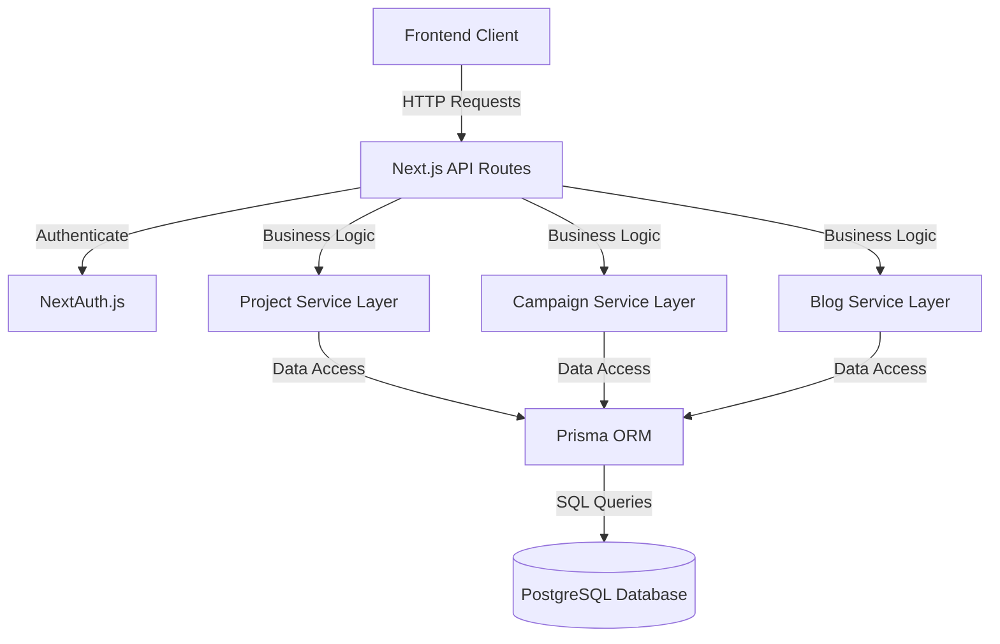
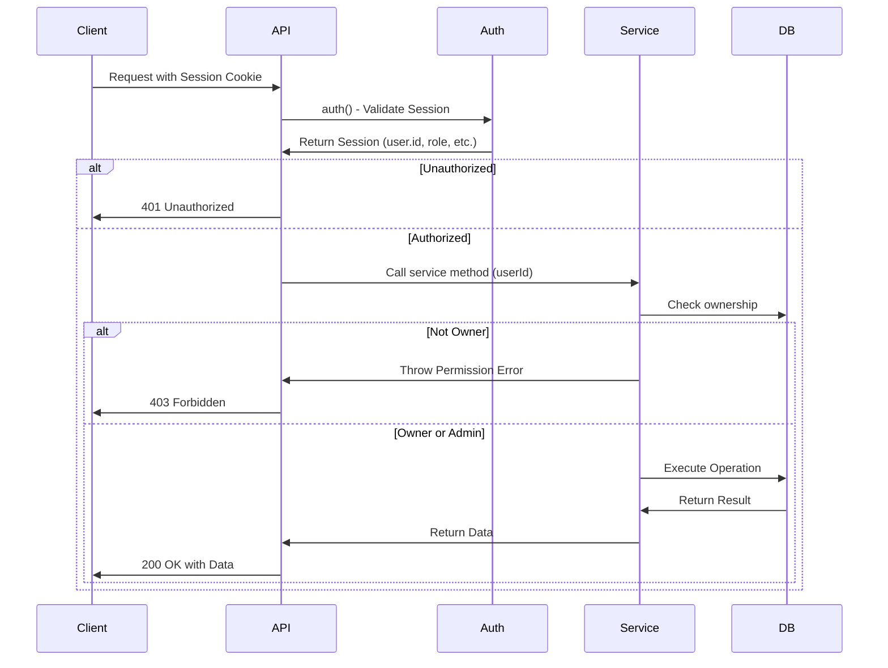
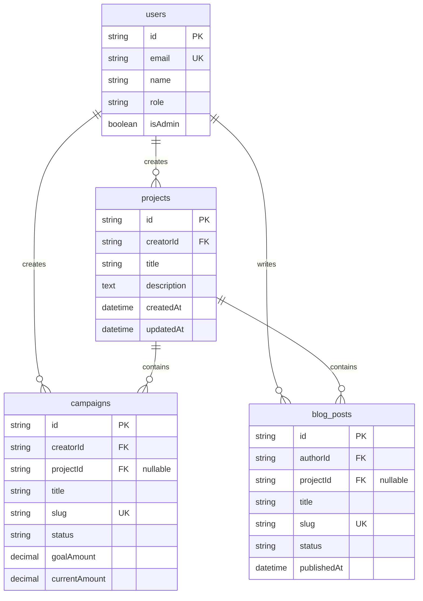
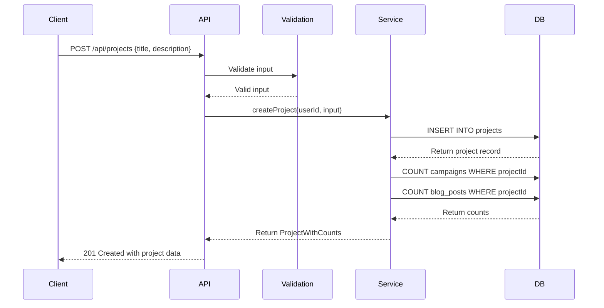
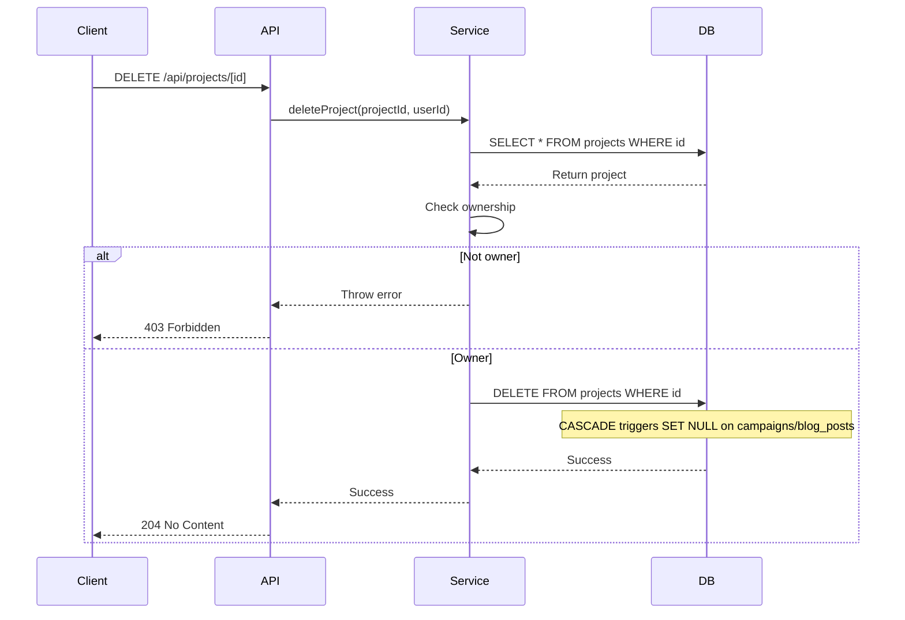

# Design Document: Project Hierarchy Management

## Overview

The Project Hierarchy Management feature introduces a new top-level entity called "Project" to the crowdfunding platform. This feature allows creators to organize multiple Campaigns and Blog Posts under a common portfolio umbrella, providing better content organization and creator workspace management.

### Key Design Decisions

1. **Optional Hierarchy**: Projects are optional—campaigns and blog posts can exist independently (backward compatibility)
2. **Soft Relationships**: When a project is deleted, associated campaigns and blog posts become standalone (SET NULL) rather than being deleted (data preservation)
3. **Single Ownership**: Each project belongs to exactly one creator, inheriting the existing user-creator relationship model
4. **Prisma-Based**: Leverages existing Prisma ORM patterns for type safety and migration management
5. **Next.js App Router**: Uses Next.js 14+ App Router patterns with server-side authentication

### Technology Stack

- **Database**: PostgreSQL with Prisma ORM
- **Backend**: Next.js 14+ API Routes (App Router)
- **Authentication**: NextAuth.js with JWT session strategy
- **Validation**: Zod for runtime type validation
- **Language**: TypeScript for full type safety

## Architecture

### System Components



### API Endpoint Structure

```
/api/projects
├── GET     - List projects (paginated, filtered by creator)
├── POST    - Create new project

/api/projects/[id]
├── GET     - Get project detail with associated campaigns/blogs
├── PATCH   - Update project
└── DELETE  - Delete project (orphan campaigns/blogs)

/api/campaigns
├── POST    - Create campaign (with optional projectId)
└── PATCH   - Update campaign (modify projectId association)

/api/blog/posts
├── POST    - Create blog post (with optional projectId)
└── PATCH   - Update blog post (modify projectId association)
```

### Authentication Flow



## Components and Interfaces

### Database Layer (Prisma Schema)

#### Projects Model

```prisma
model projects {
  id          String      @id @default(cuid())
  creatorId   String
  title       String      @db.VarChar(255)
  description String?     @db.Text
  createdAt   DateTime    @default(now())
  updatedAt   DateTime    @updatedAt
  
  // Relations
  users       users       @relation(fields: [creatorId], references: [id], onDelete: Cascade)
  campaigns   campaigns[]
  blog_posts  blog_posts[]
  
  @@index([creatorId])
}
```

#### Updated Campaigns Model

```prisma
model campaigns {
  // ... existing fields ...
  projectId   String?     // New nullable field
  
  // ... existing relations ...
  projects    projects?   @relation(fields: [projectId], references: [id], onDelete: SetNull)
  
  @@index([projectId])
}
```

#### Updated Blog Posts Model

```prisma
model blog_posts {
  // ... existing fields ...
  projectId   String?     // New nullable field
  
  // ... existing relations ...
  projects    projects?   @relation(fields: [projectId], references: [id], onDelete: SetNull)
  
  @@index([projectId])
}
```

### Service Layer

#### Project Service Interface

```typescript
// src/lib/project/project.service.ts

export interface CreateProjectInput {
  title: string;
  description?: string;
}

export interface UpdateProjectInput {
  title?: string;
  description?: string;
}

export interface ProjectWithCounts {
  id: string;
  creatorId: string;
  title: string;
  description: string | null;
  createdAt: Date;
  updatedAt: Date;
  campaignCount: number;
  blogPostCount: number;
}

export interface ProjectDetail extends ProjectWithCounts {
  campaigns: {
    id: string;
    title: string;
    slug: string;
    status: string;
    goalAmount: number;
    currentAmount: number;
    imageUrl: string | null;
  }[];
  blogPosts: {
    id: string;
    title: string;
    slug: string;
    excerpt: string | null;
    coverImage: string | null;
    publishedAt: Date | null;
  }[];
}

export interface PaginationParams {
  page: number;
  limit: number;
}

export interface PaginatedResponse<T> {
  data: T[];
  pagination: {
    page: number;
    limit: number;
    total: number;
    totalPages: number;
  };
}

export async function createProject(
  creatorId: string,
  input: CreateProjectInput
): Promise<ProjectWithCounts>;

export async function getProjectById(
  projectId: string,
  userId: string
): Promise<ProjectDetail>;

export async function listProjects(
  creatorId: string,
  pagination: PaginationParams
): Promise<PaginatedResponse<ProjectWithCounts>>;

export async function updateProject(
  projectId: string,
  userId: string,
  input: UpdateProjectInput
): Promise<ProjectWithCounts>;

export async function deleteProject(
  projectId: string,
  userId: string
): Promise<void>;

export async function validateProjectOwnership(
  projectId: string,
  userId: string,
  allowAdmin?: boolean
): Promise<boolean>;
```

### API Layer

#### Request/Response Types

```typescript
// src/types/project.types.ts

export interface CreateProjectRequest {
  title: string;
  description?: string;
}

export interface UpdateProjectRequest {
  title?: string;
  description?: string;
}

export interface ProjectResponse {
  id: string;
  creatorId: string;
  title: string;
  description: string | null;
  createdAt: string; // ISO 8601
  updatedAt: string; // ISO 8601
  campaignCount: number;
  blogPostCount: number;
}

export interface ProjectDetailResponse extends ProjectResponse {
  campaigns: {
    id: string;
    title: string;
    slug: string;
    status: string;
    goalAmount: number;
    currentAmount: number;
    imageUrl: string | null;
  }[];
  blogPosts: {
    id: string;
    title: string;
    slug: string;
    excerpt: string | null;
    coverImage: string | null;
    publishedAt: string | null; // ISO 8601
  }[];
}

export interface ProjectListResponse {
  data: ProjectResponse[];
  pagination: {
    page: number;
    limit: number;
    total: number;
    totalPages: number;
  };
}

export interface ErrorResponse {
  error: {
    message: string;
    code?: string;
    details?: any;
  };
}
```

#### Validation Schemas

```typescript
// src/lib/project/project.validation.ts

import { z } from 'zod';

export const createProjectSchema = z.object({
  title: z.string()
    .min(1, 'Title is required')
    .max(255, 'Title must not exceed 255 characters')
    .transform(val => val.trim()),
  description: z.string()
    .optional()
    .transform(val => val?.trim() || null),
});

export const updateProjectSchema = z.object({
  title: z.string()
    .min(1, 'Title cannot be empty')
    .max(255, 'Title must not exceed 255 characters')
    .transform(val => val.trim())
    .optional(),
  description: z.string()
    .transform(val => val?.trim() || null)
    .optional(),
}).refine(data => data.title !== undefined || data.description !== undefined, {
  message: 'At least one field must be provided',
});

export const paginationSchema = z.object({
  page: z.coerce.number().int().min(1, 'Page must be at least 1').default(1),
  limit: z.coerce.number().int().min(1).max(100, 'Limit must not exceed 100').default(10),
});

export const projectIdSchema = z.string().cuid('Invalid project ID format');
```

## Data Models

### Entity Relationship Diagram



### Data Flow

#### Project Creation Flow



#### Project Deletion Flow



### Database Constraints and Indexes

#### Projects Table

- **Primary Key**: `id` (CUID)
- **Foreign Keys**: 
  - `creatorId` → `users.id` (ON DELETE CASCADE)
- **Indexes**:
  - `creatorId` (for filtering by creator)
- **Constraints**:
  - `title` NOT NULL, max 255 chars
  - `createdAt` default now()
  - `updatedAt` auto-update on modification

#### Campaigns Table (Updated)

- **New Field**: `projectId` (nullable)
- **Foreign Keys**: 
  - `projectId` → `projects.id` (ON DELETE SET NULL)
- **New Index**: `projectId` (for filtering by project)

#### Blog Posts Table (Updated)

- **New Field**: `projectId` (nullable)
- **Foreign Keys**: 
  - `projectId` → `projects.id` (ON DELETE SET NULL)
- **New Index**: `projectId` (for filtering by project)


## Correctness Properties

*A property is a characteristic or behavior that should hold true across all valid executions of a system—essentially, a formal statement about what the system should do. Properties serve as the bridge between human-readable specifications and machine-verifiable correctness guarantees.*

#### Property Reflection

After analyzing all 125 acceptance criteria, I identified the following patterns of redundancy:

**Duplicates Removed:**
- Requirements 1.6 and 6.6 both test updatedAt behavior → consolidated into Property 1
- Requirements 2.3, 7.3 test same CASCADE behavior for campaigns → consolidated into Property 2
- Requirements 3.3, 7.4 test same CASCADE behavior for blog posts → consolidated into Property 3
- Requirements 2.5, 11.2 both test campaign filtering by project → consolidated into Property 4
- Requirements 3.5, 11.4 both test blog post filtering by project → consolidated into Property 5
- Requirements 6.4, 12.3 both test update authorization → covered by Property 7
- Requirements 7.5, 12.4 both test delete authorization → covered by Property 7
- Requirements 4.3, 13.1 both test empty title rejection → covered by Property 11
- Requirements 8.4, 13.5 both test campaign-project ownership validation → consolidated into Property 15
- Requirements 10.5, 13.5 both test blog-project ownership validation → consolidated into Property 16

**Combined Properties:**
- Timestamp properties (1.5, 1.6) combined into a single "timestamp management" property
- Response structure properties (19.1, 19.3, 19.5) combined into "response format consistency" property
- Cascade delete properties (2.3, 3.3) separated by entity type for clarity

### Property 1: Automatic Timestamp Management

*For any* project, when it is created, the system SHALL set createdAt to the current timestamp, and when any field is updated, the system SHALL set updatedAt to the current timestamp greater than the previous updatedAt value.

**Validates: Requirements 1.5, 1.6, 6.6**

### Property 2: Project Deletion Orphans Campaigns

*For any* project with associated campaigns, when the project is deleted, the system SHALL set projectId to NULL for all associated campaigns, making them standalone campaigns.

**Validates: Requirements 2.3, 7.3**

### Property 3: Project Deletion Orphans Blog Posts

*For any* project with associated blog posts, when the project is deleted, the system SHALL set projectId to NULL for all associated blog posts, making them platform blog posts.

**Validates: Requirements 3.3, 7.4**

### Property 4: Campaign Filtering by Project

*For any* project ID, querying campaigns with that projectId filter SHALL return all and only campaigns where campaigns.projectId matches the provided project ID.

**Validates: Requirements 2.5, 11.2**

### Property 5: Blog Post Filtering by Project

*For any* project ID, querying blog posts with that projectId filter SHALL return all and only blog posts where blog_posts.projectId matches the provided project ID.

**Validates: Requirements 3.5, 11.4**

### Property 6: Unique CUID Generation

*For any* set of projects created, the system SHALL generate unique CUID values for each project.id, and all generated IDs SHALL match the CUID format specification.

**Validates: Requirements 1.4**

### Property 7: Authorization Enforcement

*For any* project management operation (read, update, delete), when a user attempts the operation on a project not owned by them, the system SHALL return HTTP 403, unless the user has admin role.

**Validates: Requirements 12.1, 12.2, 12.3, 12.4, 6.4, 7.5**

### Property 8: Project Creation with Valid Input

*For any* valid title (non-empty, ≤255 chars) and optional description, when an authenticated creator creates a project, the system SHALL create the project with the user as creatorId and return HTTP 201 with the complete project object.

**Validates: Requirements 4.2, 4.5**

### Property 9: Partial Update Correctness

*For any* subset of updatable fields {title, description}, when a project is updated with only those fields, the system SHALL modify only the specified fields and leave other fields unchanged.

**Validates: Requirements 6.2, 6.5**

### Property 10: Successful Deletion Response

*For any* project owned by the authenticated user, when a deletion request is made, the system SHALL delete the project record and return HTTP 204 with no content.

**Validates: Requirements 7.2, 7.6**

### Property 11: Input Validation and Normalization

*For any* project creation or update request, the system SHALL trim leading and trailing whitespace from title and description, and SHALL reject titles that are empty or contain only whitespace with HTTP 400.

**Validates: Requirements 4.3, 13.1, 13.2**

### Property 12: Title Length Validation

*For any* project creation or update request with a title exceeding 255 characters, the system SHALL return HTTP 400 with error message "Title must not exceed 255 characters".

**Validates: Requirements 4.4**

### Property 13: Pagination Correctness

*For any* valid page number (≥1) and limit (1-100), when querying projects, the system SHALL return the correct subset of results sorted by createdAt descending, along with accurate pagination metadata (page, limit, total, totalPages).

**Validates: Requirements 5.2, 5.5, 19.4**

### Property 14: Pagination Boundary Validation

*For any* page parameter less than 1 or limit parameter exceeding 100, the system SHALL return HTTP 400 with appropriate error messages.

**Validates: Requirements 5.6, 5.7**

### Property 15: Campaign-Project Association Validation

*For any* campaign creation or update with a projectId parameter, the system SHALL validate that: (1) the project exists, (2) the project is owned by the authenticated user, and SHALL return HTTP 400 for invalid IDs or HTTP 403 for ownership violations.

**Validates: Requirements 8.2, 8.3, 8.4, 13.3, 13.5**

### Property 16: Blog Post-Project Association Validation

*For any* blog post creation or update with a projectId parameter, the system SHALL validate that: (1) the project exists, (2) the project is owned by the authenticated user, and SHALL return HTTP 400 for invalid IDs or HTTP 403 for ownership violations.

**Validates: Requirements 10.3, 10.4, 10.5, 13.3, 13.5**

### Property 17: Campaign Project Reassignment

*For any* existing campaign, when updated with a different projectId (or null), the system SHALL change campaigns.projectId to the new value and return HTTP 200 with the updated campaign object.

**Validates: Requirements 9.2, 9.5**

### Property 18: Standalone Item Filtering

*For any* query with projectId parameter set to "null" or "standalone", the system SHALL return only campaigns or blog posts where projectId is NULL.

**Validates: Requirements 11.5**

### Property 19: Associated Count Accuracy

*For any* project, when retrieved in a list or detail view, the system SHALL include accurate counts of associated campaigns and blog posts matching the actual number of records with that projectId.

**Validates: Requirements 5.3, 20.2**

### Property 20: Response Format Consistency

*For any* successful project API response, the system SHALL return JSON with camelCase property names, ISO 8601 formatted timestamps (YYYY-MM-DDTHH:mm:ss.sssZ), and the structure: { id, creatorId, title, description, createdAt, updatedAt, campaignCount, blogPostCount }.

**Validates: Requirements 19.1, 19.3, 19.5**

### Property 21: Error Response Structure

*For any* API error, the system SHALL return a response with the structure: { error: { message, code, details } }.

**Validates: Requirements 19.2**

### Property 22: Validation Error Aggregation

*For any* request with multiple validation errors, the system SHALL return all validation errors in a single response array.

**Validates: Requirements 14.5**

### Property 23: Project Detail Completeness

*For any* valid project ID requested by the owner, the system SHALL return HTTP 200 with the project object including complete arrays of associated campaign objects (with fields: id, title, slug, status, goalAmount, currentAmount, imageUrl) and blog post objects (with fields: id, title, slug, excerpt, coverImage, publishedAt).

**Validates: Requirements 20.2, 20.4, 20.5**

### Property 24: Null ProjectId Representation

*For any* campaign or blog post with NULL projectId, API responses SHALL either omit the projectId field or return it as null (not undefined or empty string).

**Validates: Requirements 17.4**

### Property 25: SQL Injection Protection

*For any* input parameter containing SQL injection attempts (e.g., '; DROP TABLE--), the system SHALL safely handle the input through parameterized queries without executing the malicious SQL or causing database errors.

**Validates: Requirements 18.1, 18.2**

### Property 26: CUID Format Validation

*For any* projectId value provided in requests, the system SHALL validate that it matches the CUID format before executing database queries, returning HTTP 400 for invalid formats.

**Validates: Requirements 18.4**

### Property 27: Migration Idempotence

*For any* database state, running the migration script multiple times SHALL result in the same final schema state without errors or duplicate changes.

**Validates: Requirements 16.4**


## Error Handling

### Error Categories and Responses

#### 1. Authentication Errors (401 Unauthorized)

**Scenarios:**
- No session cookie present
- Invalid or expired JWT token
- User deleted or deactivated

**Response Format:**
```json
{
  "error": {
    "message": "Authentication required",
    "code": "UNAUTHORIZED"
  }
}
```

**Implementation:**
```typescript
const session = await auth();
if (!session?.user?.id) {
  return NextResponse.json(
    { error: { message: "Authentication required", code: "UNAUTHORIZED" } },
    { status: 401 }
  );
}
```

#### 2. Authorization Errors (403 Forbidden)

**Scenarios:**
- Non-creator user attempts to create project
- User attempts to access/modify another user's project
- User attempts to associate content with another user's project

**Response Format:**
```json
{
  "error": {
    "message": "Not authorized to [action] this project",
    "code": "FORBIDDEN"
  }
}
```

**Implementation:**
```typescript
const project = await prisma.projects.findUnique({ where: { id: projectId } });
if (project.creatorId !== session.user.id && !session.user.isAdmin) {
  return NextResponse.json(
    { error: { message: "Not authorized to update this project", code: "FORBIDDEN" } },
    { status: 403 }
  );
}
```

#### 3. Validation Errors (400 Bad Request)

**Scenarios:**
- Empty or whitespace-only title
- Title exceeding 255 characters
- Invalid projectId format (not CUID)
- Invalid pagination parameters
- Multiple validation failures

**Response Format (Single Error):**
```json
{
  "error": {
    "message": "Title is required",
    "code": "VALIDATION_ERROR",
    "details": {
      "field": "title",
      "constraint": "required"
    }
  }
}
```

**Response Format (Multiple Errors):**
```json
{
  "error": {
    "message": "Validation failed",
    "code": "VALIDATION_ERROR",
    "details": [
      {
        "field": "title",
        "message": "Title is required",
        "constraint": "required"
      },
      {
        "field": "limit",
        "message": "Limit must not exceed 100",
        "constraint": "max"
      }
    ]
  }
}
```

**Implementation:**
```typescript
import { createProjectSchema } from '@/lib/project/project.validation';

try {
  const validated = createProjectSchema.parse(body);
} catch (error) {
  if (error instanceof z.ZodError) {
    return NextResponse.json(
      {
        error: {
          message: "Validation failed",
          code: "VALIDATION_ERROR",
          details: error.errors.map(e => ({
            field: e.path.join('.'),
            message: e.message,
            constraint: e.code
          }))
        }
      },
      { status: 400 }
    );
  }
}
```

#### 4. Not Found Errors (404 Not Found)

**Scenarios:**
- Project ID doesn't exist
- User attempts to access deleted project

**Response Format:**
```json
{
  "error": {
    "message": "Project not found",
    "code": "NOT_FOUND"
  }
}
```

#### 5. Conflict Errors (409 Conflict)

**Scenarios:**
- Database constraint violations
- Attempting to delete user with existing projects (FK constraint)

**Response Format:**
```json
{
  "error": {
    "message": "Cannot delete user with existing projects",
    "code": "CONSTRAINT_VIOLATION"
  }
}
```

#### 6. Service Unavailable (503 Service Unavailable)

**Scenarios:**
- Database connection failure
- Prisma client initialization error

**Response Format:**
```json
{
  "error": {
    "message": "Service temporarily unavailable",
    "code": "SERVICE_UNAVAILABLE"
  }
}
```

**Implementation:**
```typescript
try {
  // ... database operations
} catch (error) {
  if (error.code === 'ECONNREFUSED' || error.message.includes('connection')) {
    return NextResponse.json(
      { error: { message: "Service temporarily unavailable", code: "SERVICE_UNAVAILABLE" } },
      { status: 503 }
    );
  }
  throw error; // Re-throw for other error types
}
```

#### 7. Internal Server Errors (500 Internal Server Error)

**Scenarios:**
- Unexpected runtime errors
- Unhandled exceptions

**Response Format:**
```json
{
  "error": {
    "message": "Internal server error",
    "code": "INTERNAL_ERROR"
  }
}
```

**Implementation:**
```typescript
try {
  // ... operation logic
} catch (error) {
  console.error('[API Error]', {
    operation: 'createProject',
    userId: session.user.id,
    timestamp: new Date().toISOString(),
    error: error.stack
  });
  
  return NextResponse.json(
    { error: { message: "Internal server error", code: "INTERNAL_ERROR" } },
    { status: 500 }
  );
}
```

### Error Logging Strategy

**Log Structure:**
```typescript
interface ErrorLog {
  timestamp: string; // ISO 8601
  operation: string; // e.g., 'createProject', 'deleteProject'
  userId?: string;
  projectId?: string;
  errorType: string; // error.constructor.name
  errorMessage: string;
  errorStack?: string;
  requestMetadata: {
    method: string;
    path: string;
    params?: any;
    body?: any; // Sanitized, no sensitive data
  };
}
```

**Implementation:**
```typescript
function logError(error: Error, context: ErrorContext) {
  const log: ErrorLog = {
    timestamp: new Date().toISOString(),
    operation: context.operation,
    userId: context.userId,
    projectId: context.projectId,
    errorType: error.constructor.name,
    errorMessage: error.message,
    errorStack: process.env.NODE_ENV === 'development' ? error.stack : undefined,
    requestMetadata: {
      method: context.method,
      path: context.path,
      params: context.params,
      body: sanitizeBody(context.body) // Remove passwords, tokens, etc.
    }
  };
  
  console.error('[PROJECT_ERROR]', JSON.stringify(log));
  
  // Optional: Send to external logging service
  // await logService.error(log);
}
```

### Resilience Patterns

#### 1. Database Connection Retry

```typescript
async function withRetry<T>(
  operation: () => Promise<T>,
  maxRetries: number = 3,
  delayMs: number = 1000
): Promise<T> {
  for (let attempt = 1; attempt <= maxRetries; attempt++) {
    try {
      return await operation();
    } catch (error) {
      if (attempt === maxRetries) throw error;
      if (isRetryableError(error)) {
        await delay(delayMs * attempt); // Exponential backoff
        continue;
      }
      throw error; // Non-retryable error
    }
  }
  throw new Error('Unreachable');
}

function isRetryableError(error: any): boolean {
  return error.code === 'ECONNREFUSED' ||
         error.code === 'ETIMEDOUT' ||
         error.message?.includes('connection');
}
```

#### 2. Graceful Degradation

For non-critical operations like counting associations:

```typescript
async function getProjectWithCounts(projectId: string): Promise<ProjectWithCounts> {
  const project = await prisma.projects.findUnique({ where: { id: projectId } });
  
  if (!project) {
    throw new NotFoundError('Project not found');
  }
  
  let campaignCount = 0;
  let blogPostCount = 0;
  
  try {
    campaignCount = await prisma.campaigns.count({ where: { projectId } });
  } catch (error) {
    console.warn('Failed to count campaigns', error);
    // Continue with count = 0
  }
  
  try {
    blogPostCount = await prisma.blog_posts.count({ where: { projectId } });
  } catch (error) {
    console.warn('Failed to count blog posts', error);
    // Continue with count = 0
  }
  
  return { ...project, campaignCount, blogPostCount };
}
```

#### 3. Transaction Safety

For operations that modify multiple tables:

```typescript
async function associateCampaignWithProject(
  campaignId: string,
  projectId: string,
  userId: string
): Promise<void> {
  await prisma.$transaction(async (tx) => {
    // Verify project ownership
    const project = await tx.projects.findUnique({ where: { id: projectId } });
    if (!project || project.creatorId !== userId) {
      throw new UnauthorizedError('Not authorized to add campaigns to this project');
    }
    
    // Verify campaign ownership
    const campaign = await tx.campaigns.findUnique({ where: { id: campaignId } });
    if (!campaign || campaign.creatorId !== userId) {
      throw new UnauthorizedError('Not authorized to modify this campaign');
    }
    
    // Update association
    await tx.campaigns.update({
      where: { id: campaignId },
      data: { projectId }
    });
  });
}
```

## Testing Strategy

### Overview

The testing strategy employs a **dual approach** combining property-based testing for universal correctness guarantees with example-based unit tests for specific scenarios and edge cases.

### Testing Pyramid

```
         /\
        /  \         E2E Tests (10%)
       /----\        - Complete user flows
      /      \       - Real database integration
     /--------\      
    /   INTE-  \     Integration Tests (20%)
   /   GRATION  \    - API endpoint tests
  /--------------\   - Database integration
 /                \  
/  PROPERTY TESTS  \ Property-Based Tests (40%)
--------------------
 UNIT + EXAMPLES    Unit Tests (30%)
--------------------
```

### Property-Based Testing (PBT)

**Framework:** `fast-check` (JavaScript/TypeScript PBT library)

**Why PBT is Appropriate:**

This feature is well-suited for property-based testing because:

1. **Pure Business Logic**: CRUD operations with clear input/output behavior
2. **Universal Properties**: Authorization, validation, and data integrity rules that should hold for all inputs
3. **Wide Input Space**: Titles, descriptions, IDs, pagination parameters
4. **Transformation Logic**: Data normalization (trimming whitespace), timestamp management

**PBT Configuration:**

- **Minimum iterations per test:** 100
- **Tag format:** `Feature: project-hierarchy-management, Property {number}: {property_text}`
- **Generators:** Custom generators for projects, campaigns, blog posts, user IDs, CUIDs

#### Property Test Examples

**Property 1: Timestamp Management**

```typescript
import fc from 'fast-check';
import { createProject, updateProject } from '@/lib/project/project.service';

describe('Property 1: Automatic Timestamp Management', () => {
  /**
   * Feature: project-hierarchy-management, Property 1:
   * For any project, when it is created, createdAt shall be set to current timestamp,
   * and when updated, updatedAt shall be greater than previous updatedAt.
   */
  it('should manage timestamps correctly for all projects', async () => {
    await fc.assert(
      fc.asyncProperty(
        fc.record({
          title: fc.string({ minLength: 1, maxLength: 255 }),
          description: fc.option(fc.string(), { nil: null })
        }),
        fc.string({ minLength: 20, maxLength: 30 }), // userId (CUID-like)
        async (projectData, userId) => {
          const beforeCreate = Date.now();
          
          const created = await createProject(userId, projectData);
          
          const afterCreate = Date.now();
          const createdAtMs = new Date(created.createdAt).getTime();
          
          // createdAt should be between beforeCreate and afterCreate
          expect(createdAtMs).toBeGreaterThanOrEqual(beforeCreate);
          expect(createdAtMs).toBeLessThanOrEqual(afterCreate);
          expect(created.updatedAt).toEqual(created.createdAt);
          
          // Wait a bit to ensure updatedAt changes
          await new Promise(resolve => setTimeout(resolve, 10));
          
          const beforeUpdate = Date.now();
          const updated = await updateProject(created.id, userId, { title: 'Updated Title' });
          const afterUpdate = Date.now();
          
          const updatedAtMs = new Date(updated.updatedAt).getTime();
          
          // updatedAt should be greater than createdAt and within update window
          expect(updatedAtMs).toBeGreaterThan(createdAtMs);
          expect(updatedAtMs).toBeGreaterThanOrEqual(beforeUpdate);
          expect(updatedAtMs).toBeLessThanOrEqual(afterUpdate);
        }
      ),
      { numRuns: 100 }
    );
  });
});
```

**Property 6: Unique CUID Generation**

```typescript
describe('Property 6: Unique CUID Generation', () => {
  /**
   * Feature: project-hierarchy-management, Property 6:
   * For any set of projects created, all project IDs shall be unique valid CUIDs.
   */
  it('should generate unique CUIDs for all projects', async () => {
    await fc.assert(
      fc.asyncProperty(
        fc.array(
          fc.record({
            title: fc.string({ minLength: 1, maxLength: 255 }),
            description: fc.option(fc.string(), { nil: null })
          }),
          { minLength: 2, maxLength: 20 }
        ),
        fc.string({ minLength: 20, maxLength: 30 }), // userId
        async (projectsData, userId) => {
          const createdProjects = await Promise.all(
            projectsData.map(data => createProject(userId, data))
          );
          
          const ids = createdProjects.map(p => p.id);
          
          // All IDs should be unique
          const uniqueIds = new Set(ids);
          expect(uniqueIds.size).toBe(ids.length);
          
          // All IDs should match CUID format (starting with 'c', length 25)
          ids.forEach(id => {
            expect(id).toMatch(/^c[a-z0-9]{24}$/);
          });
        }
      ),
      { numRuns: 100 }
    );
  });
});
```

**Property 11: Input Validation and Normalization**

```typescript
describe('Property 11: Input Validation and Normalization', () => {
  /**
   * Feature: project-hierarchy-management, Property 11:
   * For any project request, system shall trim whitespace and reject empty titles.
   */
  it('should trim whitespace and reject empty titles', async () => {
    await fc.assert(
      fc.asyncProperty(
        fc.string({ minLength: 1, maxLength: 255 }),
        fc.nat({ max: 10 }), // leading whitespace count
        fc.nat({ max: 10 }), // trailing whitespace count
        fc.string({ minLength: 20, maxLength: 30 }), // userId
        async (title, leadingSpaces, trailingSpaces, userId) => {
          const paddedTitle = ' '.repeat(leadingSpaces) + title + ' '.repeat(trailingSpaces);
          const trimmed = title.trim();
          
          if (trimmed.length === 0 || /^\s*$/.test(trimmed)) {
            // Should reject empty or whitespace-only titles
            await expect(
              createProject(userId, { title: paddedTitle })
            ).rejects.toThrow(/Title is required|Title cannot be empty/);
          } else {
            // Should accept and trim
            const created = await createProject(userId, { title: paddedTitle });
            expect(created.title).toBe(trimmed);
          }
        }
      ),
      { numRuns: 100 }
    );
  });
});
```

#### Custom Generators

```typescript
// src/lib/project/__tests__/generators.ts

import fc from 'fast-check';

export const projectTitleArb = fc.string({ minLength: 1, maxLength: 255 })
  .filter(s => s.trim().length > 0); // Valid titles only

export const projectDescriptionArb = fc.option(
  fc.string({ maxLength: 5000 }),
  { nil: null }
);

export const projectArb = fc.record({
  title: projectTitleArb,
  description: projectDescriptionArb
});

export const cuidArb = fc.string({ minLength: 25, maxLength: 25 })
  .map(s => 'c' + s.substring(1)); // Rough CUID format

export const paginationArb = fc.record({
  page: fc.integer({ min: 1, max: 100 }),
  limit: fc.integer({ min: 1, max: 100 })
});

export const invalidProjectIdArb = fc.oneof(
  fc.constant('invalid-id'),
  fc.string({ maxLength: 10 }),
  fc.string({ minLength: 30 }),
  fc.constant(''),
  fc.constant('null'),
  fc.constant('undefined')
);
```

### Unit Tests (Example-Based)

Unit tests focus on:
- Specific examples demonstrating correct behavior
- Edge cases and error conditions
- Integration points between components
- Authentication and authorization flows

#### Example Unit Tests

```typescript
describe('Project API', () => {
  describe('POST /api/projects', () => {
    it('should create project with authenticated creator', async () => {
      const session = await createTestSession({ role: 'CREATOR' });
      
      const response = await fetch('/api/projects', {
        method: 'POST',
        headers: { 'Content-Type': 'application/json' },
        body: JSON.stringify({
          title: 'My Project',
          description: 'Project description'
        }),
        cookies: { session: session.cookie }
      });
      
      expect(response.status).toBe(201);
      const body = await response.json();
      expect(body).toMatchObject({
        title: 'My Project',
        description: 'Project description',
        creatorId: session.userId,
        campaignCount: 0,
        blogPostCount: 0
      });
    });
    
    it('should return 401 for unauthenticated request', async () => {
      const response = await fetch('/api/projects', {
        method: 'POST',
        headers: { 'Content-Type': 'application/json' },
        body: JSON.stringify({ title: 'Test' })
      });
      
      expect(response.status).toBe(401);
      const body = await response.json();
      expect(body.error.message).toBe('Authentication required');
    });
    
    it('should return 403 for non-creator user', async () => {
      const session = await createTestSession({ role: 'BACKER' });
      
      const response = await fetch('/api/projects', {
        method: 'POST',
        headers: { 'Content-Type': 'application/json' },
        body: JSON.stringify({ title: 'Test' }),
        cookies: { session: session.cookie }
      });
      
      expect(response.status).toBe(403);
      const body = await response.json();
      expect(body.error.message).toBe('Creator role required');
    });
  });
  
  describe('DELETE /api/projects/[id]', () => {
    it('should orphan associated campaigns and blog posts', async () => {
      const { project, campaigns, blogs } = await createTestProjectWithContent();
      const session = await createTestSession({ userId: project.creatorId });
      
      const response = await fetch(`/api/projects/${project.id}`, {
        method: 'DELETE',
        cookies: { session: session.cookie }
      });
      
      expect(response.status).toBe(204);
      
      // Verify project deleted
      const deletedProject = await prisma.projects.findUnique({
        where: { id: project.id }
      });
      expect(deletedProject).toBeNull();
      
      // Verify campaigns orphaned
      const orphanedCampaigns = await prisma.campaigns.findMany({
        where: { id: { in: campaigns.map(c => c.id) } }
      });
      orphanedCampaigns.forEach(c => {
        expect(c.projectId).toBeNull();
      });
      
      // Verify blogs orphaned
      const orphanedBlogs = await prisma.blog_posts.findMany({
        where: { id: { in: blogs.map(b => b.id) } }
      });
      orphanedBlogs.forEach(b => {
        expect(b.projectId).toBeNull();
      });
    });
  });
});
```

### Integration Tests

Integration tests verify:
- Database schema and constraints
- Prisma ORM integration
- Full API endpoint flows
- Error handling and logging
- Performance characteristics

```typescript
describe('Database Integration', () => {
  it('should enforce foreign key constraint on creatorId', async () => {
    const userId = 'test_user_id';
    
    // Create user
    await prisma.users.create({
      data: { id: userId, email: 'test@test.com', name: 'Test' }
    });
    
    // Create project
    await prisma.projects.create({
      data: {
        id: 'test_project_id',
        creatorId: userId,
        title: 'Test Project'
      }
    });
    
    // Attempt to delete user should fail due to CASCADE constraint
    await expect(
      prisma.users.delete({ where: { id: userId } })
    ).rejects.toThrow(/foreign key constraint/);
  });
  
  it('should set projectId to NULL when project deleted (SET NULL)', async () => {
    const { project, campaign } = await createTestProjectWithCampaign();
    
    await prisma.projects.delete({ where: { id: project.id } });
    
    const updatedCampaign = await prisma.campaigns.findUnique({
      where: { id: campaign.id }
    });
    
    expect(updatedCampaign.projectId).toBeNull();
  });
});
```

### E2E Tests

End-to-end tests verify complete user workflows:

```typescript
describe('Project Management E2E', () => {
  it('should complete full project lifecycle', async () => {
    // 1. Create creator account
    const creator = await signUp({ email: 'creator@test.com', role: 'CREATOR' });
    
    // 2. Create project
    const project = await creator.createProject({
      title: 'My Crowdfunding Project',
      description: 'A great project'
    });
    
    // 3. Create campaigns under project
    const campaign1 = await creator.createCampaign({
      title: 'Campaign 1',
      projectId: project.id
    });
    const campaign2 = await creator.createCampaign({
      title: 'Campaign 2',
      projectId: project.id
    });
    
    // 4. Create blog post under project
    const blog = await creator.createBlogPost({
      title: 'Project Update',
      projectId: project.id
    });
    
    // 5. Retrieve project with associations
    const retrieved = await creator.getProject(project.id);
    expect(retrieved.campaigns).toHaveLength(2);
    expect(retrieved.blogPosts).toHaveLength(1);
    
    // 6. Move campaign to standalone
    await creator.updateCampaign(campaign1.id, { projectId: null });
    
    // 7. Delete project
    await creator.deleteProject(project.id);
    
    // 8. Verify campaigns and blog are standalone
    const standaloneCampaign = await creator.getCampaign(campaign2.id);
    expect(standaloneCampaign.projectId).toBeNull();
    
    const standaloneBlog = await creator.getBlogPost(blog.id);
    expect(standaloneBlog.projectId).toBeNull();
  });
});
```

### Test Organization

```
__tests__/
├── unit/
│   ├── project.service.test.ts
│   ├── project.validation.test.ts
│   └── project.api.test.ts
├── property/
│   ├── project.properties.test.ts
│   ├── campaign-association.properties.test.ts
│   └── blog-association.properties.test.ts
├── integration/
│   ├── database.integration.test.ts
│   ├── api.integration.test.ts
│   └── performance.integration.test.ts
└── e2e/
    └── project-lifecycle.e2e.test.ts
```

### Coverage Goals

- **Property tests:** Cover all 27 correctness properties with 100 iterations each
- **Unit tests:** Cover API endpoints, service methods, validation logic
- **Integration tests:** Cover database constraints, error handling, performance
- **E2E tests:** Cover at least 3 complete user workflows

### CI/CD Integration

```yaml
# .github/workflows/test.yml
name: Test

on: [push, pull_request]

jobs:
  test:
    runs-on: ubuntu-latest
    steps:
      - uses: actions/checkout@v2
      - uses: actions/setup-node@v2
      
      - name: Install dependencies
        run: npm ci
      
      - name: Run unit tests
        run: npm run test:unit
      
      - name: Run property tests
        run: npm run test:property
      
      - name: Run integration tests
        run: npm run test:integration
        env:
          DATABASE_URL: ${{ secrets.TEST_DATABASE_URL }}
      
      - name: Run E2E tests
        run: npm run test:e2e
        env:
          DATABASE_URL: ${{ secrets.TEST_DATABASE_URL }}
          NEXTAUTH_SECRET: ${{ secrets.TEST_NEXTAUTH_SECRET }}
```

