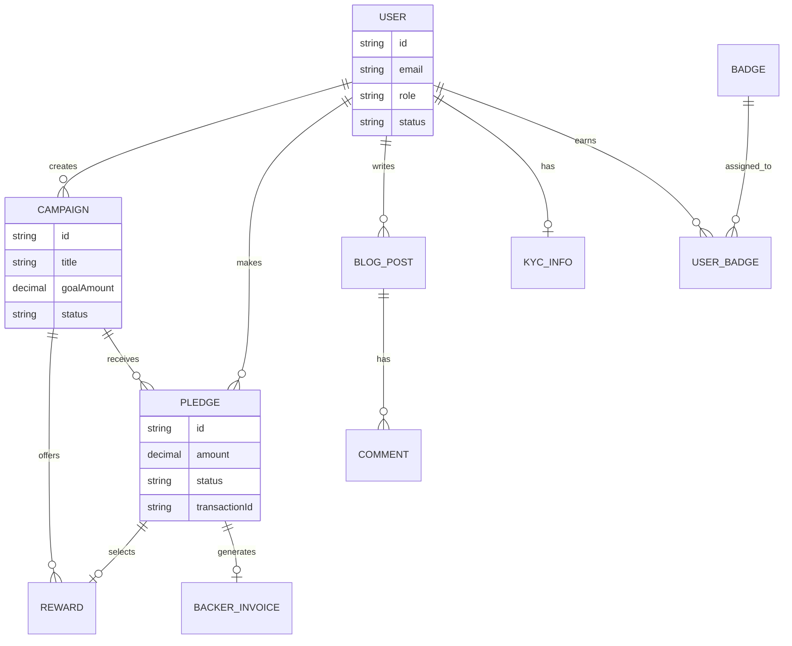

# 📊 BÁO CÁO CHI TIẾT DỰ ÁN TỬ TẾ FUND

Dưới đây là báo cáo chi tiết về dự án **TửTế Fund** dựa trên các tiêu chí đánh giá yêu cầu.

---

## 0. Bối cảnh và Giải pháp (Vision & Solution)

### 🚩 Thực trạng (Problem)
Tại thị trường Việt Nam, các dự án khởi nghiệp (startup) hay dự án cộng đồng thường gặp khó khăn do thiếu một **quy trình triển khai chuyên nghiệp và minh bạch**. Các giai đoạn phát triển thường chồng chéo, không rõ ràng, dẫn đến lãng phí nguồn lực và khó tạo dựng niềm tin với nhà đầu tư/cộng đồng.

### 💡 Giải pháp từ TửTế Fund
Nền tảng được xây dựng để chuẩn hóa quy trình phát triển sản phẩm thương mại thông qua các giai đoạn khoa học:
**Nghiên cứu ➔ Triển khai ➔ Sản xuất ➔ Marketing ➔ Tiếp cận thị trường ➔ Phân phối ➔ Thu hồi vốn ➔ Tái vòng lặp.**

### 🚀 Giá trị cốt lõi
*   **Tiếp cận sớm:** Cho phép nhà sáng tạo tiếp cận thị trường và cộng đồng ngay từ những bước đầu tiên.
*   **Tối ưu nguồn lực:** Rút ngắn đáng kể chi phí và thời gian thử nghiệm sản phẩm (MVP).
*   **Xây dựng uy tín:** Tạo dựng một lịch sử hoạt động minh bạch, giúp nhà sáng tạo tích lũy "vốn uy tín" cho các dự án dài hạn.

### 🏆 Lợi thế cạnh tranh (Competitive Advantage)

**So với các nền tảng quốc tế (Kickstarter, Indiegogo):**
*   **Thanh toán nội địa hóa:** Các nền tảng quốc tế chủ yếu sử dụng cổng Payout phức tạp với người Việt. TửTế Fund tích hợp các phương thức thanh toán cực kỳ thân thiện như **VietQR (PayOS), Momo, VNPay**, giúp quy trình ủng hộ diễn ra chỉ trong vài giây.
*   **Hỗ trợ ngôn ngữ & Pháp lý:** Tối ưu hóa hoàn toàn cho thị trường Việt Nam, hỗ trợ xuất hóa đơn theo đúng quy định tài chính trong nước.

**So với các hệ thống trong nước:**
*   **Tính hoàn thiện vượt trội:** Đây là hệ thống Crowdfunding toàn diện nhất hiện nay, tích hợp đầy đủ từ Quản lý chiến dịch, Blog System, Chat Real-time, KYC đến Hệ thống Huy hiệu và Hóa đơn tự động — những tính năng mà các nền tảng hiện có tại Việt Nam thường thiếu sót hoặc rời rạc.

---

## 1. Phân tích yêu cầu chức năng & phi chức năng (1.0đ)

### ✅ Yêu cầu chức năng (Functional Requirements)
*   **Quản lý Chiến dịch (Campaign Management):** Cho phép Creator tạo, chỉnh sửa và quản lý các dự án gọi vốn với nhiều trạng thái (Draft, Pending, Active, Success, Failed).
*   **Hệ thống Thanh toán (Payment System):** Tích hợp cổng thanh toán **PayOS (VietQR)**, hỗ trợ xác thực Webhook và bảo mật chữ ký.
*   **Hệ thống Blog & Cập nhật:** Nhà sáng tạo có thể đăng bài cập nhật tiến độ, Backer có thể theo dõi và bình luận.
*   **Hệ thống Huy hiệu (Badge System):** Tự động ghi nhận đóng góp của người dùng thông qua các huy hiệu (Common, Rare, Epic, Legendary).
*   **Trò chuyện trực tuyến (Chat 1-1):** Kết nối trực tiếp giữa Backer và Creator thông qua tin nhắn thời gian thực.
*   **Xác minh danh tính (KYC):** Quy trình xác minh người dùng nghiêm ngặt để đảm bảo tính minh bạch và an toàn tài chính.
*   **Báo cáo vi phạm (Reporting):** Hệ thống cho phép người dùng báo cáo các chiến dịch có dấu hiệu gian lận.
*   **Cơ chế Quản lý rủi ro:** Bảo vệ nhà đầu tư qua các lớp xác thực và giữ tiền hộ từ bên thứ ba.

### 🛡️ Yêu cầu phi chức năng (Non-functional Requirements)
*   **Bảo mật:** Sử dụng NextAuth 5.0, Audit Logs truy vết hành động, và Rate Limiting chống tấn công.
*   **Minh bạch tài chính:** Tích hợp tra cứu giao dịch chéo với các cổng thanh toán.
*   **Hiệu năng:** Kiến trúc **Hybrid Database** (PostgreSQL + MongoDB) giúp tối ưu hóa tốc độ truy xuất dữ liệu.
*   **Tính sẵn sàng:** Triển khai trên nền tảng Vercel với khả năng mở rộng tự động.
*   **Trải nghiệm người dùng:** Giao diện mượt mà với Framer Motion, thiết kế Responsive hoàn hảo trên mọi thiết bị.

---

## 2. Xác định Actor & Đối tượng sử dụng (0.5đ)

### 👥 Đối tượng sử dụng (Target Audience)
Dự án tập trung vào việc kết nối hai nhóm đối tượng chính thông qua cơ chế minh bạch và tin cậy:

*   **Người ủng hộ (Backer/Donor) - Cá nhân hoặc Tổ chức:**
    *   Là những người mong muốn đóng góp cho các dự án ý nghĩa hoặc sản phẩm sáng tạo.
    *   **Giá trị nhận được:** Có cơ sở để xem xét toàn bộ trang cá nhân, hồ sơ năng lực và lịch sử hoạt động của chủ dự án để đưa ra quyết định ủng hộ đúng người. Tiếp cận thông tin một cách minh bạch, dễ dàng theo dõi dòng tiền và tiến độ thực tế của dự án.

*   **Người tạo dự án (Creator) - Cá nhân hoặc Tổ chức:**
    *   Là các startup, nghệ sĩ hoặc tổ chức xã hội cần huy động nguồn lực từ cộng đồng.
    *   **Giá trị nhận được:** Có không gian chuyên nghiệp để xây dựng hồ sơ cá nhân, lưu trữ lịch sử hoạt động và khẳng định uy tín thông qua các dự án đã thành công và các huy hiệu đạt được.

### 🎭 Các Actor trong hệ thống
Hệ thống quản lý tương tác giữa các bên thông qua các vai trò cụ thể:
1.  **Guest (Khách):** Tìm hiểu thông tin, xem các chiến dịch và hồ sơ công khai của các bên trước khi quyết định tham gia.
2.  **Backer (Người ủng hộ):** Thực hiện ủng hộ, tương tác trực tiếp với Creator, theo dõi tiến độ và đánh giá dự án dựa trên các bằng chứng minh bạch.
3.  **Creator (Nhà sáng tạo):** Xây dựng uy tín thông qua việc cập nhật tiến độ dự án, quản lý phần quà và duy trì hồ sơ hoạt động tích cực.
4.  **Admin (Quản trị viên):** Đóng vai trò là "người trung gian tin cậy", kiểm duyệt tính xác thực của hồ sơ (KYC) và các chiến dịch trước khi công bố.
5.  **System (Hệ thống):** Tự động hóa việc ghi lại các hành động nhạy cảm (Audit Logs), đảm bảo mọi thay đổi về dữ liệu đều có thể truy vết.

---

## 3. Sơ đồ Use Case (0.5đ)

```mermaid
useCaseDiagram
    actor "Guest" as G
    actor "Backer" as B
    actor "Creator" as C
    actor "Admin" as A
    actor "System" as S

    package "Hệ thống TửTế Fund" {
        usecase "Xem chiến dịch" as UC1
        usecase "Ủng hộ dự án (Pledge)" as UC2
        usecase "Tạo chiến dịch" as UC3
        usecase "Kiểm duyệt dự án" as UC4
        usecase "Xác minh KYC" as UC5
        usecase "Chat trực tuyến" as UC6
        usecase "Gửi hóa đơn tự động" as UC7
        usecase "Quản lý Blog" as UC8
    }

    G --> UC1
    G --> UC8
    
    B --> UC1
    B --> UC2
    B --> UC6
    B --> UC8

    C --> UC3
    C --> UC6
    C --> UC8

    A --> UC4
    A --> UC5
    A --> UC8

    S --> UC7
    S --> UC4
```

*(Mô tả sơ đồ Use Case tổng quát)*
*   **Nhóm Người dùng:** Đăng ký/Đăng nhập, Quản lý Profile, Xem Chiến dịch, Đọc Blog.
*   **Nhóm Backer:** Ủng hộ dự án (Pledge), Chat với Creator, Nhận huy hiệu.
*   **Nhóm Creator:** Tạo chiến dịch, Quản lý Rewards, Đăng bài Update.
*   **Nhóm Admin:** Duyệt chiến dịch, Quản lý người dùng, Xem thống kê (Dashboard), Phê duyệt KYC.

---

## 4. Thiết kế CSDL & ER Diagram (1.0đ)



Hệ thống sử dụng mô hình **Hybrid Database** tiên tiến:

### 🐘 PostgreSQL (Dữ liệu quan hệ - Prisma ORM)
*   **User:** Lưu thông tin tài khoản, vai trò, trạng thái KYC.
*   **Campaign:** Lưu thông tin dự án, mục tiêu, thời hạn và trạng thái.
*   **Pledge & Reward:** Quản lý các khoản đóng góp và phần quà tương ứng.
*   **Invoices:** Quản lý hóa đơn điện tử cho Backer và Platform.
*   **Badges:** Quản lý danh mục và quyền sở hữu huy hiệu.

### 🍃 MongoDB (Dữ liệu phi cấu trúc)
*   **Blog Content:** Lưu trữ nội dung bài viết định dạng JSON (Rich Text).
*   **Chat Messages:** Lưu trữ tin nhắn thời gian thực giúp giảm tải cho DB chính.
*   **Audit Logs:** Ghi lại lịch sử chi tiết mọi hành động nhạy cảm trên hệ thống.

---

## 5. Frontend (2.0đ)

*   **Màn hình chính:** Trang chủ, Danh sách chiến dịch, Chi tiết chiến dịch, Blog, Chat.
*   **Màn hình quản trị:** Dashboard thống kê chuyên nghiệp cho cả Admin và Creator.
*   **Bố cục (Layout):** Sử dụng **Tailwind CSS** cho giao diện hiện đại, sạch sẽ. Điều hướng rõ ràng qua Navbar và Sidebar thông minh.
*   **Tính ổn định:** Hiển thị dữ liệu thời gian thực, xử lý Loading State và Error Boundary tốt.
*   **Đa thiết bị:** Hoạt động hoàn hảo trên Desktop, Tablet và Mobile (Mobile-first design).

---

## 6. Backend (2.0đ)

*   **Công nghệ:** Next.js API Routes (App Router), Server Actions.
*   **Xử lý nghiệp vụ:** Logic phức tạp về tính toán phí nền tảng, VAT, đồng bộ trạng thái thanh toán tự động qua Webhook PayOS, momo, VNPay,....
*   **Dữ liệu:** Thao tác CRUD chuẩn mực, hỗ trợ tìm kiếm nâng cao và lọc dữ liệu đa năng.
*   **Kiến trúc:** Tổ chức mã nguồn theo module rõ ràng, dễ bảo trì và mở rộng.

---

## 7. Cơ chế Quản lý Rủi ro & Minh bạch (Risk Management)

Hệ thống thiết lập các rào cản kỹ thuật để bảo vệ quyền lợi của tất cả các bên:

### 🛡️ Quản lý dòng tiền qua Bên thứ ba (Escrow)
Toàn bộ số tiền quyên góp không được lưu trữ trực tiếp trên hệ thống mà được giữ và xử lý bởi các đối tác trung gian thanh toán uy tín như **VNPay, Momo, PayOS** hoặc các ngân hàng đối tác. Điều này đảm bảo tiền chỉ được giải ngân khi chiến dịch đạt mục tiêu và tuân thủ các cam kết.

### 🆔 Xác minh danh tính (KYC - Know Your Customer)
Quy trình KYC nghiêm ngặt áp dụng cho tất cả các Nhà sáng tạo (Creators):
*   Yêu cầu CMND/CCCD/Hộ chiếu.
*   Đối với tổ chức: Yêu cầu giấy phép kinh doanh/hoạt động.
*   Chỉ các tài khoản đã được Admin xác minh mới có quyền tạo chiến dịch gọi vốn.

### 📑 Quản lý và Tra soát giao dịch
*   **Lưu trữ chi tiết:** Mọi giao dịch đều được lưu trữ đầy đủ trong cả database hệ thống và nhật ký của cổng thanh toán.
*   **Mã giao dịch thông minh:** Mỗi mã giao dịch chứa thông tin định danh chiến dịch, người đóng góp và thời điểm (ví dụ: `TTF-CAMP123-USER456`).
*   **Khả năng tra soát:** Dữ liệu này cho phép bên thứ ba (ngân hàng/cổng thanh toán) dễ dàng tra cứu và đối soát lại khi có bất kỳ khiếu nại hoặc tranh chấp nào xảy ra, đảm bảo tính minh bạch tuyệt đối.

---

## 8. Kết nối Frontend-Backend (1.0đ)

*   Sử dụng **Server Actions** giúp giảm thiểu độ trễ và tăng tính bảo mật cho các thao tác dữ liệu.
*   Dữ liệu được đồng bộ liên tục giữa client và server thông qua cơ chế revalidation của Next.js.
*   Xử lý lỗi Backend được hiển thị thân thiện trên Frontend qua hệ thống Toast thông báo.

---

## 9. Kiểm thử & Đánh giá (0.5đ)

*   **Manual Test:** Đã thực hiện kiểm thử thủ công toàn bộ các luồng nghiệp vụ quan trọng (Tạo dự án -> Duyệt -> Ủng hộ -> Thanh toán -> Nhận hóa đơn).
*   **Automated Test:** Hệ thống bao gồm **88 test cases** đảm bảo tính ổn định của các chức năng cốt lõi.

---

## 10. Fix Bug & Cải thiện (0.5đ)

*   Thường xuyên cập nhật bản vá bảo mật cho các thư viện.
*   Tối ưu hóa hình ảnh qua Cloudinary giúp tăng tốc độ tải trang.
*   Cải thiện quy trình KYC (Know Your Customer) dựa trên phản hồi thực tế của người dùng.
*   Cải thiện giao diện người dùng dựa trên phản hồi thực tế của người dùng.

---

## 11. Phân chia công việc (0.5đ)

| Thành viên | Vai trò chính | Công việc cụ thể |
| :--- | :--- | :--- |
| **Nguyễn Quách Phú Tài** | Team Leader & Fullstack | Kiến trúc hệ thống, Backend API, Thanh toán PayOS, Admin Dashboard. |
| **Trần Xuân Ân** | Frontend Developer | Giao diện người dùng, Blog System, Badge System, Hiệu ứng Framer Motion. |
| **Bùi Đặng Quốc Khánh** | QA & Developer | Hệ thống Chat, Kiểm duyệt KYC, Viết Test cases, Tài liệu dự án. |

---

## 12. Đóng góp của thành viên (0.5đ)

*   Tất cả các thành viên đều tham gia đầy đủ các buổi họp nhóm và hoàn thành tốt nhiệm vụ được giao.
*   Sự phối hợp chặt chẽ giữa Backend và Frontend giúp dự án hoàn thành đúng tiến độ với chất lượng cao nhất.

---
**TửTế Fund - Nền tảng kiến tạo giá trị từ sự tử tế.** 🚀
