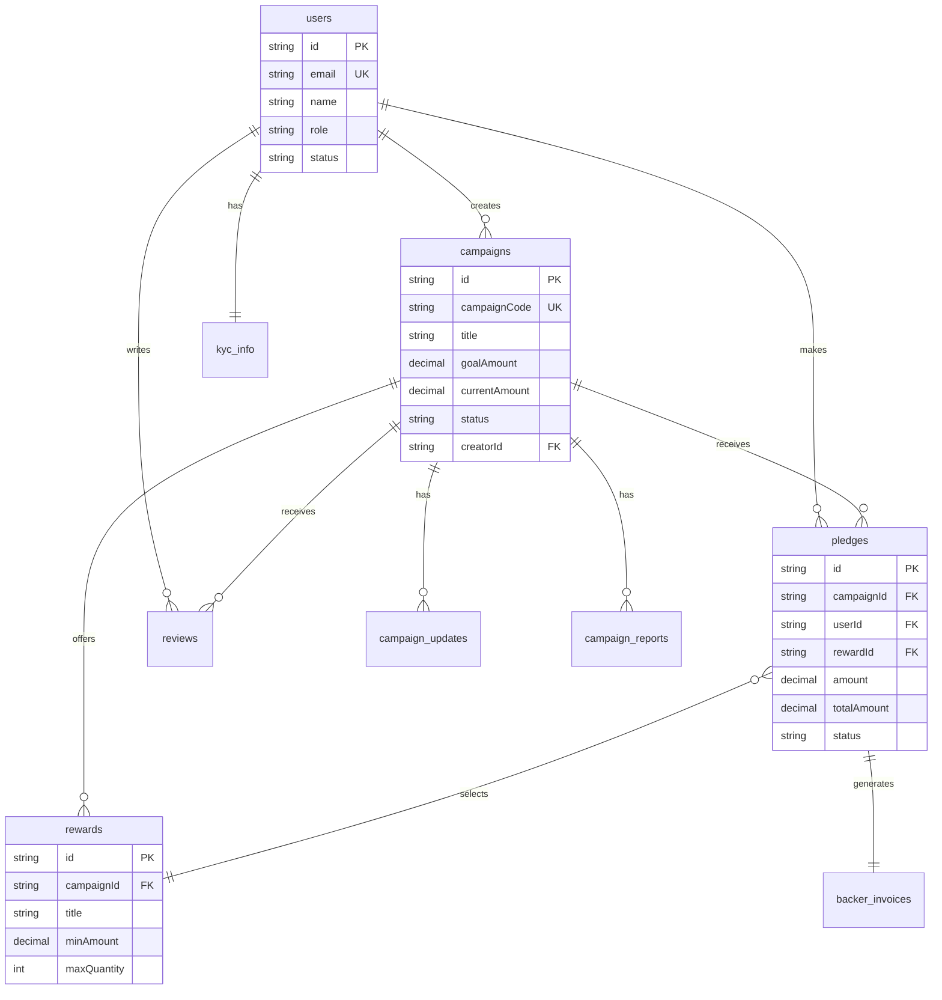

# 📊 HƯỚNG DẪN TẠO SƠ ĐỒ CƠ SỞ DỮ LIỆU

## 🎯 CÁC PHƯƠNG PHÁP TẠO SƠ ĐỒ

---

## PHƯƠNG PHÁP 1: SỬ DỤNG DBDIAGRAM.IO ⭐ (KHUYÊN DÙNG)

### Bước 1: Truy cập website
```
https://dbdiagram.io/
```

### Bước 2: Tạo tài khoản miễn phí
- Đăng ký bằng email hoặc GitHub
- Hoàn toàn miễn phí

### Bước 3: Tạo diagram mới
- Click "New Diagram"
- Chọn "PostgreSQL" làm database type

### Bước 4: Copy code DBML vào editor

```dbml
// ============================================================
// CROWDFUNDING VN - DATABASE SCHEMA
// ============================================================

Table users {
  id varchar [pk, note: 'CUID']
  email varchar [unique, not null]
  password varchar
  name varchar [not null]
  displayName varchar
  avatar varchar
  image varchar
  coverImage varchar
  phone varchar
  shippingAddress text
  role user_role [default: 'BACKER']
  status user_status [default: 'NORMAL']
  isOrganization boolean [default: false]
  isAdmin boolean [default: false]
  bio text
  location varchar
  website varchar
  socialLinks json
  idCard varchar
  businessLicense varchar
  bankAccount varchar
  bankName varchar
  approvedAt timestamp
  createdAt timestamp [default: `now()`]
  updatedAt timestamp [default: `now()`]
  
  indexes {
    email
    role
    status
  }
}

Table campaigns {
  id varchar [pk, note: 'CUID']
  campaignCode varchar [unique, not null]
  slug varchar [unique, not null]
  title varchar [not null]
  description text [not null]
  longDescription text
  videoUrl varchar
  imageUrl varchar
  images varchar[] [note: 'Array of image URLs']
  type campaign_type [default: 'REWARD']
  category varchar [not null]
  tags varchar[] [note: 'Array of tags']
  goalAmount decimal [not null]
  currentAmount decimal [default: 0]
  status campaign_status [default: 'DRAFT']
  startDate timestamp
  endDate timestamp
  creatorId varchar [not null, ref: > users.id]
  feeRate float [default: 0.08]
  createdAt timestamp [default: `now()`]
  updatedAt timestamp [default: `now()`]
  
  indexes {
    category
    tags
    status
    creatorId
  }
}

Table rewards {
  id varchar [pk, note: 'CUID']
  campaignId varchar [not null, ref: > campaigns.id]
  title varchar [not null]
  description text
  minAmount decimal [not null, note: 'Minimum pledge amount']
  maxQuantity int [note: 'null = unlimited']
  deliveryDate timestamp
  isActive boolean [default: true]
  createdAt timestamp [default: `now()`]
  updatedAt timestamp [default: `now()`]
  
  indexes {
    campaignId
  }
}

Table pledges {
  id varchar [pk, note: 'CUID']
  campaignId varchar [not null, ref: > campaigns.id]
  userId varchar [ref: > users.id]
  rewardId varchar [ref: > rewards.id]
  displayName varchar [not null]
  isAnonymous boolean [default: false]
  email varchar
  phoneNumber varchar
  shippingAddress text
  amount decimal [not null]
  tipAmount decimal [default: 0]
  platformFee decimal [default: 0]
  vatAmount decimal [default: 0]
  totalAmount decimal [not null]
  paymentProvider varchar [not null]
  transactionId varchar [unique, not null]
  payosOrderCode varchar [unique]
  ipAddress varchar
  deviceInfo json
  status pledge_status [default: 'PENDING']
  refundStatus refund_status [default: 'NO_REFUND']
  refundedAt timestamp
  invoiceGroupDate timestamp
  webhookProcessedAt timestamp
  createdAt timestamp [default: `now()`]
  updatedAt timestamp [default: `now()`]
  
  indexes {
    campaignId
    userId
    status
    transactionId
  }
}

Table campaign_updates {
  id varchar [pk, note: 'CUID']
  campaignId varchar [not null, ref: > campaigns.id]
  title varchar [not null]
  content text [not null]
  imageUrl varchar
  tags varchar[]
  isPinned boolean [default: false]
  createdAt timestamp [default: `now()`]
  updatedAt timestamp [default: `now()`]
  
  indexes {
    (campaignId, isPinned)
    tags
  }
}

Table reviews {
  id varchar [pk, note: 'CUID']
  userId varchar [not null, ref: > users.id]
  campaignId varchar [ref: > campaigns.id]
  rating int [not null, note: '1-5 stars']
  comment text [not null]
  imageUrl varchar
  createdAt timestamp [default: `now()`]
  
  indexes {
    userId
    campaignId
  }
}

Table campaign_reports {
  id varchar [pk, note: 'CUID']
  campaignId varchar [not null, ref: > campaigns.id]
  userId varchar [not null, ref: > users.id]
  reason report_reason [not null]
  description text [not null]
  status report_status [default: 'PENDING']
  resolvedAt timestamp
  resolvedBy varchar
  resolution text
  createdAt timestamp [default: `now()`]
  updatedAt timestamp [default: `now()`]
  
  indexes {
    campaignId
    userId
    status
    (campaignId, userId) [unique]
  }
}

Table campaign_followers {
  id varchar [pk, note: 'CUID']
  campaignId varchar [not null, ref: > campaigns.id]
  userId varchar [ref: > users.id]
  email varchar
  createdAt timestamp [default: `now()`]
  
  indexes {
    campaignId
    userId
    (campaignId, userId) [unique]
    (campaignId, email) [unique]
  }
}

Table kyc_info {
  id varchar [pk, note: 'CUID']
  userId varchar [unique, not null, ref: - users.id]
  fullName varchar [not null]
  idCardNumber varchar [unique, not null]
  idCardType id_card_type [not null]
  idCardFrontImage varchar
  idCardBackImage varchar
  idCardIssueDate timestamp
  idCardIssuePlace varchar
  dateOfBirth timestamp
  placeOfBirth varchar
  nationality varchar [default: 'VN']
  permanentAddress text
  currentAddress text
  occupation varchar
  monthlyIncome varchar
  verificationStatus kyc_status [default: 'PENDING']
  verifiedAt timestamp
  verifiedBy varchar
  rejectedReason text
  riskLevel risk_level [default: 'LOW']
  createdAt timestamp [default: `now()`]
  updatedAt timestamp [default: `now()`]
  
  indexes {
    userId
    verificationStatus
  }
}

Table backer_invoices {
  id varchar [pk, note: 'CUID']
  invoiceNumber varchar [unique, not null]
  pledgeId varchar [unique, not null, ref: - pledges.id]
  backerName varchar [not null]
  backerEmail varchar
  backerPhone varchar
  backerAddress text
  backerTaxCode varchar
  companyName varchar
  amount decimal [not null]
  tipAmount decimal [not null]
  platformFee decimal [not null]
  vatAmount decimal [not null]
  totalAmount decimal [not null]
  campaignTitle varchar [not null]
  paymentMethod varchar [not null]
  transactionId varchar [not null]
  status invoice_status [default: 'PENDING']
  issuedAt timestamp [default: `now()`]
  pdfUrl varchar
  sentAt timestamp
  createdAt timestamp [default: `now()`]
  updatedAt timestamp [default: `now()`]
  
  indexes {
    pledgeId
    invoiceNumber
  }
}

Table platform_invoices {
  id varchar [pk, note: 'CUID']
  invoiceNumber varchar [unique, not null]
  campaignId varchar [not null, ref: > campaigns.id]
  creatorId varchar [not null, ref: > users.id]
  amount decimal [not null]
  vatAmount decimal [not null]
  totalAmount decimal [not null]
  status invoice_status [default: 'PENDING']
  dueDate timestamp [not null]
  paidAt timestamp
  paymentMethod varchar
  createdAt timestamp [default: `now()`]
  updatedAt timestamp [default: `now()`]
  
  indexes {
    campaignId
    creatorId
    status
  }
}

Table audit_logs {
  id varchar [pk, note: 'CUID']
  userId varchar [ref: > users.id]
  action audit_action [not null]
  entityType varchar [not null]
  entityId varchar [not null]
  oldValue json
  newValue json
  changes json
  ipAddress varchar
  userAgent text
  reason text
  metadata json
  createdAt timestamp [default: `now()`]
  
  indexes {
    (entityType, entityId)
    userId
    createdAt
  }
}

Table blacklist {
  id varchar [pk, note: 'CUID']
  type blacklist_type [not null]
  value varchar [not null]
  reason text [not null]
  addedBy varchar
  isActive boolean [default: true]
  expiresAt timestamp
  createdAt timestamp [default: `now()`]
  updatedAt timestamp [default: `now()`]
  
  indexes {
    (type, value) [unique]
    (type, value, isActive)
  }
}

Table transaction_limits {
  id varchar [pk, note: 'CUID']
  userId varchar [unique, ref: > users.id]
  kycStatus kyc_status
  maxPerTransaction decimal [not null]
  maxPerDay decimal [not null]
  maxPerMonth decimal [not null]
  maxTransactionsPerDay int [not null]
  isActive boolean [default: true]
  createdAt timestamp [default: `now()`]
  updatedAt timestamp [default: `now()`]
}

Table daily_tip_invoices {
  id varchar [pk, note: 'CUID']
  invoiceDate timestamp [unique, not null]
  totalTip decimal [not null]
  totalVat decimal [not null]
  status varchar [default: 'PENDING']
  createdAt timestamp [default: `now()`]
}

// ============================================================
// ENUMS
// ============================================================

Enum user_role {
  ADMIN
  BACKER
  CREATOR_PENDING
  CREATOR
}

Enum user_status {
  NORMAL
  PRO
  BANNED
}

Enum campaign_type {
  REWARD
  DONATION
}

Enum campaign_status {
  DRAFT
  PENDING_REVIEW
  ACTIVE
  SUCCESS
  FAILED
  CANCELED
}

Enum pledge_status {
  PENDING
  SUCCESS
  FAILED
  REFUNDED
}

Enum refund_status {
  NO_REFUND
  REQUESTED
  PROCESSING
  COMPLETED
  FAILED
}

Enum invoice_status {
  PENDING
  PAID
  OVERDUE
  CANCELLED
}

Enum id_card_type {
  CMND
  CCCD
  PASSPORT
}

Enum kyc_status {
  PENDING
  VERIFIED
  REJECTED
  EXPIRED
}

Enum risk_level {
  LOW
  MEDIUM
  HIGH
  CRITICAL
}

Enum audit_action {
  CREATE
  UPDATE
  DELETE
  REFUND
  APPROVE
  REJECT
  CANCEL
  LOGIN
  LOGOUT
  KYC_SUBMIT
  KYC_APPROVE
  KYC_REJECT
}

Enum blacklist_type {
  IP
  EMAIL
  PHONE
  BANK_ACCOUNT
  DEVICE_ID
}

Enum report_reason {
  FRAUD
  INAPPROPRIATE
  MISLEADING
  SCAM
  INTELLECTUAL_PROPERTY
  OTHER
}

Enum report_status {
  PENDING
  REVIEWING
  RESOLVED
  DISMISSED
}
```

### Bước 5: Export sơ đồ
- Click "Export" → Chọn định dạng:
  - **PNG** (cho slide)
  - **PDF** (cho báo cáo)
  - **SVG** (chất lượng cao)

---

## PHƯƠNG PHÁP 2: SỬ DỤNG DRAW.IO / DIAGRAMS.NET

### Bước 1: Truy cập
```
https://app.diagrams.net/
```

### Bước 2: Tạo diagram mới
- Chọn "Create New Diagram"
- Chọn template "Entity Relationship"

### Bước 3: Vẽ các bảng
**Các bảng chính cần vẽ:**
1. users
2. campaigns
3. pledges
4. rewards
5. campaign_updates
6. reviews
7. campaign_reports
8. kyc_info
9. backer_invoices
10. platform_invoices
11. audit_logs
12. blacklist

### Bước 4: Vẽ quan hệ
**Quan hệ chính:**
- users → campaigns (1:n) - Creator
- campaigns → pledges (1:n)
- campaigns → rewards (1:n)
- pledges → rewards (n:1)
- users → pledges (1:n)
- campaigns → campaign_updates (1:n)
- users → reviews (1:n)
- campaigns → reviews (1:n)
- users → kyc_info (1:1)
- pledges → backer_invoices (1:1)

### Bước 5: Export
- File → Export as → PNG/PDF/SVG

---

## PHƯƠNG PHÁP 3: SỬ DỤNG PRISMA STUDIO

### Bước 1: Mở Prisma Studio
```bash
cd d:\Du_An\crowdfunding-vn
npx prisma studio
```

### Bước 2: Chụp màn hình
- Prisma Studio hiển thị các bảng và quan hệ
- Chụp màn hình từng phần
- Ghép lại bằng PowerPoint hoặc Photoshop

---

## PHƯƠNG PHÁP 4: SỬ DỤNG LUCIDCHART

### Bước 1: Truy cập
```
https://www.lucidchart.com/
```

### Bước 2: Tạo tài khoản
- Đăng ký miễn phí (có giới hạn)
- Hoặc dùng tài khoản trường học

### Bước 3: Tạo ERD
- Chọn template "Entity Relationship Diagram"
- Kéo thả các entity
- Vẽ relationships

### Bước 4: Export
- File → Download → PNG/PDF

---

## PHƯƠNG PHÁP 5: SỬ DỤNG MERMAID (CODE)

### Tạo file mermaid


### Render online
- Truy cập: https://mermaid.live/
- Paste code vào
- Export PNG/SVG

---

## PHƯƠNG PHÁP 6: SỬ DỤNG MYSQL WORKBENCH

### Bước 1: Cài đặt
```
https://dev.mysql.com/downloads/workbench/
```

### Bước 2: Reverse Engineer
- Database → Reverse Engineer
- Kết nối đến PostgreSQL database
- Tạo ERD tự động

### Bước 3: Export
- File → Export → Export as PNG/PDF

---

## PHƯƠNG PHÁP 7: SỬ DỤNG DATAGRIP (JETBRAINS)

### Bước 1: Cài đặt
```
https://www.jetbrains.com/datagrip/
```

### Bước 2: Kết nối database
- Kết nối đến PostgreSQL
- Right-click database → Diagrams → Show Visualization

### Bước 3: Export
- Right-click diagram → Export to File

---

## 🍃 MONGODB COLLECTIONS SCHEMA

### Thêm vào dbdiagram.io (sau phần PostgreSQL)

```dbml
// ============================================================
// MONGODB COLLECTIONS - HYBRID DATABASE
// ============================================================

Table mongo_campaign_updates {
  _id objectid [pk, note: 'MongoDB ObjectId']
  campaignId varchar [note: 'FK to PostgreSQL campaigns.id']
  creatorId varchar [note: 'FK to PostgreSQL users.id']
  title varchar [not null]
  content text [not null, note: 'Rich text HTML/Markdown']
  type varchar [note: 'TEXT, MILESTONE, MEDIA, ANNOUNCEMENT']
  status varchar [default: 'PUBLISHED']
  isPinned boolean [default: false]
  tags varchar[]
  media json [note: 'Array of media objects']
  viewCount int [default: 0]
  publishedAt timestamp
  createdAt timestamp [default: `now()`]
  updatedAt timestamp [default: `now()`]
  
  Note: 'Campaign updates with rich content'
}

Table mongo_comments {
  _id objectid [pk, note: 'MongoDB ObjectId']
  campaignId varchar [note: 'FK to PostgreSQL campaigns.id']
  userId varchar [note: 'FK to PostgreSQL users.id']
  userName varchar [not null]
  userAvatar varchar
  content text [not null]
  parentId varchar [note: 'Parent comment _id for nested replies']
  depth int [default: 0, note: 'Max depth = 2']
  reactions json [note: 'Array of reaction objects']
  editHistory json [note: 'Array of edit history']
  isEdited boolean [default: false]
  isDeleted boolean [default: false]
  status varchar [default: 'APPROVED']
  replyCount int [default: 0]
  createdAt timestamp [default: `now()`]
  updatedAt timestamp [default: `now()`]
  
  Note: 'Nested comments with reactions'
}

Table mongo_notifications {
  _id objectid [pk, note: 'MongoDB ObjectId']
  userId varchar [not null, note: 'FK to PostgreSQL users.id']
  type varchar [not null, note: 'PLEDGE_RECEIVED, PAYMENT_SUCCESS, etc.']
  title varchar [not null]
  message text [not null]
  payload json [note: 'Notification data']
  isRead boolean [default: false]
  readAt timestamp
  createdAt timestamp [default: `now()`]
  updatedAt timestamp [default: `now()`]
  
  Note: 'User notifications with TTL 90 days'
}

Table mongo_activity_logs {
  _id objectid [pk, note: 'MongoDB ObjectId']
  userId varchar [note: 'FK to PostgreSQL users.id, nullable']
  action varchar [not null, note: 'USER_LOGIN, CAMPAIGN_VIEW, etc.']
  entityType varchar [not null]
  entityId varchar [not null]
  details json
  metadata json [note: 'IP, userAgent, sessionId, path']
  createdAt timestamp [default: `now()`]
  updatedAt timestamp [default: `now()`]
  
  Note: 'User activity tracking with TTL 90 days'
}

Table mongo_audit_logs {
  _id objectid [pk, note: 'MongoDB ObjectId']
  userId varchar [note: 'FK to PostgreSQL users.id, nullable']
  action varchar [not null, note: 'CREATE, UPDATE, DELETE, etc.']
  entityType varchar [not null]
  entityId varchar [not null]
  oldValue json
  newValue json
  changes json
  ipAddress varchar
  userAgent text
  reason text
  metadata json
  pgAuditLogId varchar [note: 'Cross-reference to PostgreSQL audit_logs']
  createdAt timestamp [default: `now()`]
  updatedAt timestamp [default: `now()`]
  
  Note: 'Parallel audit logs with PostgreSQL, TTL 365 days'
}

Table mongo_analytics_events {
  _id objectid [pk, note: 'MongoDB ObjectId']
  eventName varchar [not null, note: 'PAGE_VIEW, CAMPAIGN_VIEW, etc.']
  userId varchar [note: 'FK to PostgreSQL users.id, nullable']
  campaignId varchar [note: 'FK to PostgreSQL campaigns.id, nullable']
  sessionId varchar
  path varchar
  payload json
  device json [note: 'Browser, OS, device type']
  createdAt timestamp [default: `now()`]
  updatedAt timestamp [default: `now()`]
  
  Note: 'Analytics and tracking events, TTL 180 days'
}

Table mongo_campaign_content {
  _id objectid [pk, note: 'MongoDB ObjectId']
  campaignId varchar [unique, not null, note: 'FK to PostgreSQL campaigns.id']
  lastSavedBy varchar [not null, note: 'FK to PostgreSQL users.id']
  version int [default: 1]
  sections json [note: 'Array of content sections']
  mediaGallery json [note: 'Array of media objects']
  customFields json
  isDraft boolean [default: false]
  publishedAt timestamp
  versionHistory json [note: 'Max 5 versions']
  createdAt timestamp [default: `now()`]
  updatedAt timestamp [default: `now()`]
  
  Note: 'Rich campaign content with versioning'
}

Table mongo_user_metadata {
  _id objectid [pk, note: 'MongoDB ObjectId']
  userId varchar [unique, not null, note: 'FK to PostgreSQL users.id']
  preferences json [note: 'Email, push, language, timezone']
  onboarding json [note: 'Completed steps, status']
  stats json [note: 'Denormalized counters']
  tags varchar[] [note: 'User interest tags']
  customData json
  createdAt timestamp [default: `now()`]
  updatedAt timestamp [default: `now()`]
  
  Note: 'Extended user profile and preferences'
}

Table mongo_report_metadata {
  _id objectid [pk, note: 'MongoDB ObjectId']
  pgReportId varchar [unique, not null, note: 'FK to PostgreSQL campaign_reports.id']
  campaignId varchar [not null, note: 'FK to PostgreSQL campaigns.id']
  userId varchar [not null, note: 'FK to PostgreSQL users.id']
  evidence json [note: 'Array of evidence objects']
  adminNotes json [note: 'Array of admin notes']
  priority varchar [default: 'MEDIUM', note: 'LOW, MEDIUM, HIGH, CRITICAL']
  createdAt timestamp [default: `now()`]
  updatedAt timestamp [default: `now()`]
  
  Note: 'Extended report metadata and evidence'
}

// ============================================================
// HYBRID DATABASE RELATIONSHIPS
// ============================================================

// MongoDB references PostgreSQL (via string IDs)
// PostgreSQL campaigns.id → mongo_campaign_updates.campaignId
// PostgreSQL campaigns.id → mongo_comments.campaignId
// PostgreSQL users.id → mongo_notifications.userId
// PostgreSQL users.id → mongo_user_metadata.userId
// PostgreSQL campaign_reports.id → mongo_report_metadata.pgReportId
```

---

## 📊 CÁC LOẠI SƠ ĐỒ CẦN TẠO

### 1. ERD (Entity Relationship Diagram)
**Mục đích:** Hiển thị các bảng và quan hệ

**Nội dung:**
- Tất cả 12 bảng chính
- Primary Keys
- Foreign Keys
- Relationships (1:1, 1:n, n:m)

### 2. Database Schema Diagram
**Mục đích:** Chi tiết cấu trúc từng bảng

**Nội dung:**
- Tên bảng
- Tất cả columns
- Data types
- Constraints
- Indexes

### 3. Hybrid Database Architecture
**Mục đích:** Hiển thị kiến trúc Hybrid

**Nội dung:**
```
┌─────────────────────────────────────────────────────────┐
│              APPLICATION LAYER (Next.js)                │
│         Frontend + API Routes + Server Actions          │
└────────────────────┬────────────────────────────────────┘
                     │
        ┌────────────┴────────────┐
        │                         │
┌───────▼──────────┐    ┌────────▼──────────┐
│   PostgreSQL     │    │     MongoDB       │
│   (Prisma ORM)   │    │  (Native Driver)  │
├──────────────────┤    ├───────────────────┤
│ • users          │    │ • campaign_updates│
│ • campaigns      │    │ • comments        │
│ • pledges        │◄───┤ • notifications   │
│ • rewards        │    │ • activity_logs   │
│ • transactions   │    │ • audit_logs      │
│ • invoices       │    │ • analytics       │
│ • kyc_info       │    │ • campaign_content│
│ • reviews        │    │ • user_metadata   │
│ • reports        │───►│ • report_metadata │
│ • audit_logs     │    │                   │
└──────────────────┘    └───────────────────┘
     │                           │
     │  ACID Transactions        │  Flexible Schema
     │  Relational Data          │  High Write Speed
     │  Financial Data           │  Logs & Analytics
```

**Chi tiết phân chia:**

**PostgreSQL (Prisma):**
- ✅ Dữ liệu quan hệ chính
- ✅ Giao dịch tài chính (ACID)
- ✅ Users, Campaigns, Pledges
- ✅ Foreign Keys & Constraints
- ✅ 12 tables chính

**MongoDB (Native Driver):**
- ✅ Dữ liệu phi cấu trúc
- ✅ Logs & Analytics
- ✅ Rich content (blog, updates)
- ✅ Real-time data (chat, notifications)
- ✅ 9 collections chính

### 4. Data Flow Diagram
**Mục đích:** Hiển thị luồng dữ liệu

**Nội dung:**
- User → Campaign → Pledge → Invoice
- Payment flow
- Webhook flow

---

## 🎨 TIPS TẠO SƠ ĐỒ ĐẸP

### 1. Màu sắc
- **Users**: Xanh dương (#3B82F6)
- **Campaigns**: Xanh lá (#10B981)
- **Pledges**: Vàng (#F59E0B)
- **Invoices**: Tím (#8B5CF6)
- **Security**: Đỏ (#EF4444)

### 2. Layout
- Đặt bảng chính ở giữa
- Bảng liên quan xung quanh
- Relationships rõ ràng

### 3. Font
- **Tiêu đề**: Arial Bold 14pt
- **Nội dung**: Arial Regular 10pt
- **Ghi chú**: Arial Italic 8pt

### 4. Kích thước
- **Slide**: 1920x1080 (16:9)
- **Báo cáo**: A4 (210x297mm)
- **Poster**: A3 (297x420mm)

---

## 📁 FILE MẪU

Tôi đã tạo sẵn code DBML ở trên, bạn chỉ cần:
1. Copy code DBML
2. Paste vào dbdiagram.io
3. Export PNG/PDF

---

## ✅ CHECKLIST

**PostgreSQL Diagrams:**
- [ ] ERD diagram (12 bảng PostgreSQL)
- [ ] Schema diagram (chi tiết columns)
- [ ] Relationships diagram

**MongoDB Diagrams:**
- [ ] Collections diagram (9 collections)
- [ ] Document structure examples
- [ ] Indexes diagram

**Hybrid Architecture:**
- [ ] Hybrid architecture diagram (PostgreSQL + MongoDB)
- [ ] Data flow diagram (cả 2 databases)
- [ ] Integration points diagram

**Export Formats:**
- [ ] Export PNG (cho slide)
- [ ] Export PDF (cho báo cáo)
- [ ] Export SVG (chất lượng cao)

---

## 🚀 KHUYẾN NGHỊ

**Cho slide thuyết trình:**
- Dùng **dbdiagram.io** (nhanh, đẹp, chuyên nghiệp)
- Export PNG 1920x1080
- Màu sắc rõ ràng

**Cho báo cáo:**
- Dùng **Lucidchart** hoặc **Draw.io**
- Export PDF
- Chi tiết đầy đủ

**Cho documentation:**
- Dùng **Mermaid** (code-based)
- Dễ maintain
- Version control friendly

---

**Chúc bạn tạo sơ đồ thành công! 🎉**
