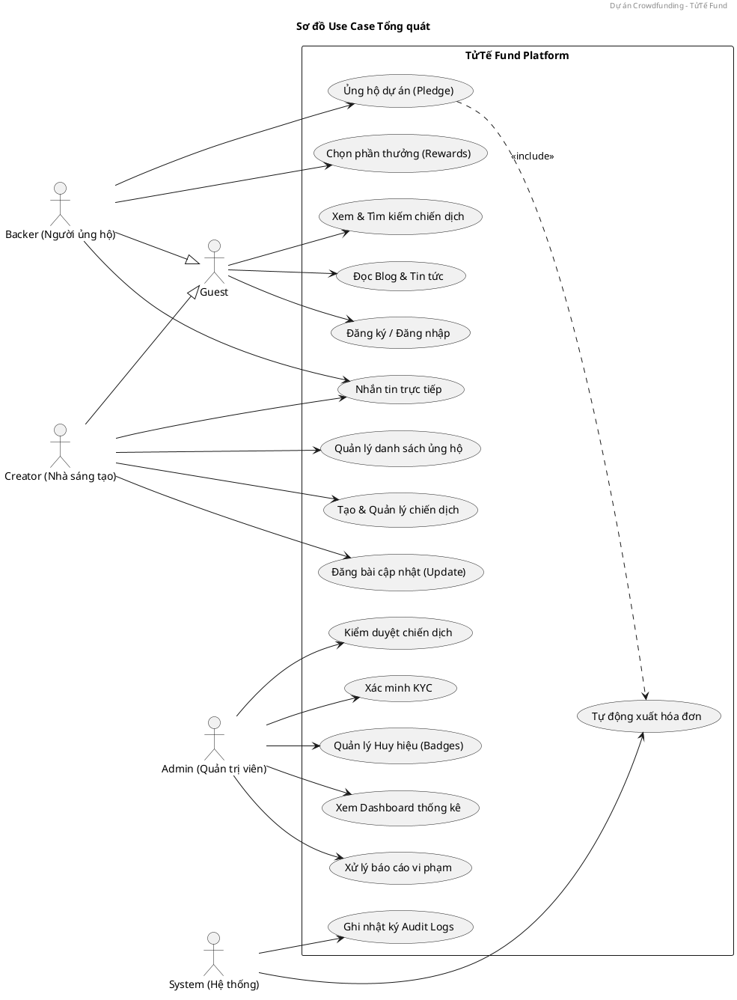

# 📊 PLANTUML USE CASE DIAGRAM - TỬ TẾ FUND

Bạn có thể sao chép mã dưới đây vào các trình chỉnh sửa PlantUML (như [PlantText](https://www.planttext.com/) hoặc extension trong VS Code) để vẽ sơ đồ.

---

### 💡 Hướng dẫn sử dụng:
1.  **Cài đặt:** Cài đặt Extension **PlantUML** trên VS Code.
2.  **Xem trước:** Nhấn `Alt + D` để xem bản vẽ trực tiếp.
3.  **Xuất ảnh:** Bạn có thể xuất ra định dạng `.png` hoặc `.svg` để chèn vào báo cáo.
