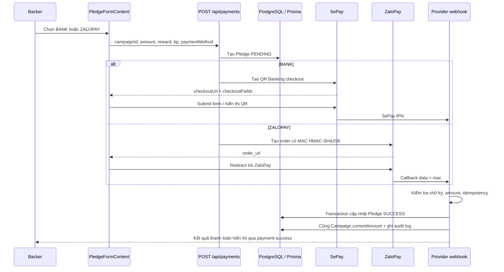

# TửTế Fund — Kiến trúc thanh toán, API và Webhook

> **Phạm vi tài liệu.** Tài liệu này mô tả phiên bản payment sau commit `f1a19a7` trên nhánh `feat/payment-bank-zalopay` và pull request #3. Mục tiêu là giúp nhóm hiểu rõ cách Backer thanh toán, cách hệ thống xác nhận tiền, và những cấu hình bắt buộc trước khi nhận tiền thật.

## 1. Những gì đã thay đổi

Trước bản cập nhật, giao diện checkout hiển thị riêng PayOS, SePay, VNPay và MoMo. Tuy nhiên, VNPay/MoMo chưa được triển khai hoàn chỉnh, PayOS production chưa khởi tạo được SDK, còn SePay thực chất là một phương án QR Banking. Điều này làm người dùng khó hiểu và làm contract giữa UI, API, type và webhook không nhất quán.

Phiên bản mới thay đổi lựa chọn công khai thành hai phương thức đơn giản hơn:

| Lựa chọn Backer nhìn thấy | Provider nội bộ hiện dùng | Mục đích |
|---|---|---|
| **Ngân hàng** (`BANK`) | **SePay** (`SEPAY`) | Chuyển khoản/QR Banking. Backer không cần biết provider kỹ thuật. |
| **ZaloPay** (`ZALOPAY`) | **ZaloPay** (`ZALOPAY`) | Thanh toán qua ví ZaloPay; redirect tới trang thanh toán ZaloPay. |

Các file chính đã được thay đổi hoặc bổ sung gồm `src/components/campaign/PledgeFormContent.tsx`, `src/app/api/payments/route.ts`, `src/lib/payment/zalopay.ts`, `src/app/api/payment/zalopay/webhook/route.ts`, các webhook SePay/PayOS và kiểm thử `__tests__/unit/zalopay.test.ts`.

## 2. Kiến trúc tổng thể



**Nguyên tắc quan trọng:** URL redirect quay lại trình duyệt chỉ dùng để hiển thị trải nghiệm người dùng. Hệ thống chỉ được xem thanh toán là thành công sau webhook server-to-server có chữ ký hợp lệ và số tiền khớp.

## 3. Contract payment công khai

Frontend chỉ gửi một trong hai giá trị:

```ts
type PublicPaymentMethod = "BANK" | "ZALOPAY";
```

Provider thực tế được lưu riêng trong Pledge:

| `paymentMethod` UI/API | `paymentProvider` lưu trong Pledge | Ghi chú |
|---|---|---|
| `BANK` | `SEPAY` | Để sau này có thể đổi provider Bank mà không phải thay UI. |
| `ZALOPAY` | `ZALOPAY` | Tương ứng trực tiếp với merchant ZaloPay. |

Điểm vào checkout chính là `POST /api/payments`.

### Request body

```json
{
  "campaignId": "campaign-id",
  "rewardId": "reward-id-hoac-null",
  "amount": 100000,
  "platformTipPercent": 5,
  "isAnonymous": false,
  "displayName": "Nguyễn Văn A",
  "guestEmail": "backer@example.com",
  "shippingAddress": "...",
  "paymentMethod": "BANK"
}
```

API chỉ nhận số tiền nguyên tối thiểu **50.000 VND**, giới hạn tip trong khoảng 0–30%, sau đó tạo Pledge với trạng thái `PENDING`. Nếu tạo order/provider thất bại, Pledge vừa tạo được chuyển sang `FAILED` để tránh bản ghi pending mồ côi.

## 4. Luồng Ngân hàng qua SePay

Khi Backer chọn **Ngân hàng**, API tạo Pledge với:

```text
paymentProvider = SEPAY
transactionId   = BANK-{pledgeId}
status          = PENDING
```

Sau đó API gọi `getSePay().createCheckoutFields()` với `paymentMethod: "BANK_TRANSFER"` và trả về:

```json
{
  "paymentMethod": "BANK",
  "paymentProvider": "SEPAY",
  "pledgeId": "...",
  "checkoutUrl": "...",
  "checkoutFields": { "...": "..." }
}
```

Frontend vẫn có thể dùng `SePayQRModal` vì đây là implementation detail của Bank flow. Tuy nhiên, giao diện không còn hiển thị SePay như một phương thức độc lập.

### Webhook SePay

Endpoint: `POST /api/payment/sepay/webhook`

Webhook chỉ xử lý `notification_type = ORDER_PAID`. Trong production, `x-sepay-signature` hoặc `body.signature` là bắt buộc; payload chữ ký sai sẽ bị từ chối với HTTP 401.

Điểm sửa quan trọng là hệ thống tìm Pledge theo `transactionId` bằng giá trị `order.order_invoice_number`. Trước đây mã invoice nhúng prefix UUID và webhook dùng `startsWith`, có thể gây nhầm pledge. Cách mới yêu cầu equality tuyệt đối với mã duy nhất `BANK-{pledgeId}`.

Khi thành công, webhook phải kiểm tra đồng thời:

1. Pledge tồn tại và đúng `paymentProvider = SEPAY`.
2. Pledge chưa ở trạng thái `SUCCESS`.
3. `order_amount` khớp `pledge.totalAmount`.
4. Order có `CAPTURED` và transaction có `APPROVED`.

Sau đó mới cập nhật Pledge, cộng tiền cho Campaign và ghi audit log.

## 5. Luồng ZaloPay

ZaloPay được triển khai theo API tạo order và callback chính thức. Merchant tạo `app_trans_id` theo tiền tố ngày Việt Nam (`yymmdd`) và sử dụng mã đó để đối soát order [1].

### Tạo order ZaloPay

File: `src/lib/payment/zalopay.ts`

`createZaloPayOrder()` gửi `POST /v2/create` tới sandbox hoặc production URL. Payload có các trường trọng yếu:

| Trường | Mô tả |
|---|---|
| `app_id` | Merchant application ID do ZaloPay cấp. |
| `app_trans_id` | Mã đơn duy nhất, bắt đầu bằng ngày `yymmdd` theo GMT+7. |
| `app_user` | User ID hoặc Pledge ID khi là khách. |
| `amount` | Tổng số tiền VND phải thanh toán. |
| `callback_url` | `https://<domain>/api/payment/zalopay/webhook`. |
| `embed_data` | Chứa `redirecturl` và `preferred_payment_method: ["zalopay_wallet"]`. |
| `mac` | HMAC-SHA256 dùng `ZALOPAY_KEY1` trên chuỗi chuẩn do ZaloPay quy định. |

Nếu tạo thành công, API trả `order_url` và frontend redirect Backer tới URL này. `order_url` không phải bằng chứng thanh toán thành công.

### Callback ZaloPay

Endpoint: `POST /api/payment/zalopay/webhook`

Theo ZaloPay, callback gồm `data`, `mac` và `type`; merchant phải xác minh `mac` bằng **callback key** trên chính raw `data` [2]. Implementation dùng `ZALOPAY_KEY2` và `crypto.timingSafeEqual`.

Luồng callback thực hiện trong Prisma transaction:

1. Xác minh `data` và `mac`.
2. Parse `app_trans_id`, `amount`, `zp_trans_id`.
3. Tìm Pledge bằng `transactionId = app_trans_id` và kiểm tra provider là `ZALOPAY`.
4. Nếu Pledge đã `SUCCESS` và có `webhookProcessedAt`, trả success idempotent, không cộng tiền lần hai.
5. So sánh `callback.amount` với `pledge.totalAmount`.
6. Cập nhật Pledge thành `SUCCESS`, đặt `webhookProcessedAt`, cộng `Campaign.currentAmount`.
7. Ghi audit log sau transaction.

`transactionId` của Pledge vẫn giữ `app_trans_id`; không ghi đè bằng `zp_trans_id`. Điều này giúp callback retry vẫn tìm đúng Pledge và hoạt động idempotent. Mã `zp_trans_id` hiện có trong metadata audit; nếu cần đối soát sâu hơn, nên bổ sung một cột provider transaction reference riêng trong schema.

## 6. Trạng thái Pledge và xử lý retry

| Trạng thái | Ý nghĩa | Ai được phép chuyển |
|---|---|---|
| `PENDING` | Pledge đã tạo nhưng provider chưa xác nhận tiền. | API create. |
| `SUCCESS` | Webhook hợp lệ đã xác nhận thanh toán. | Webhook provider. |
| `FAILED` | Không thể tạo order hoặc provider trả trạng thái thất bại. | API create/webhook provider. |
| `REFUNDED` hoặc refund state tương ứng | Tiền đã hoàn theo flow refund riêng. | Refund provider/admin flow. |

Mỗi webhook phải xem callback là **at-least-once**: provider có thể gửi lại nhiều lần. Vì vậy cần giữ `webhookProcessedAt`, kiểm tra trạng thái hiện tại, dùng mã order/transaction duy nhất và không tăng `Campaign.currentAmount` lần thứ hai.

## 7. Biến môi trường và secrets

Không đưa bất kỳ giá trị secret nào vào repository, tài liệu công khai, client bundle hoặc browser console.

| Biến môi trường | Dùng cho | Bắt buộc khi |
|---|---|---|
| `NEXTAUTH_URL` hoặc `NEXT_PUBLIC_APP_URL` | Tạo callback, return URL, cancel URL. | Mọi flow payment. |
| `SEPAY_API_KEY` và cấu hình SePay tương ứng | Tạo checkout Bank/QR và xác minh IPN. | Bật Bank qua SePay. |
| `PAYOS_CLIENT_ID` | PayOS legacy/create. | Chỉ khi bật PayOS trở lại. |
| `PAYOS_API_KEY` | PayOS legacy/create. | Chỉ khi bật PayOS trở lại. |
| `PAYOS_CHECKSUM_KEY` | Ký/xác minh webhook PayOS. | Bắt buộc ở production nếu endpoint PayOS còn public. |
| `ZALOPAY_APP_ID` | Identifies merchant app với ZaloPay. | Bật ZaloPay. |
| `ZALOPAY_KEY1` | Ký request tạo order ZaloPay. | Bật ZaloPay. |
| `ZALOPAY_KEY2` | Xác minh callback ZaloPay. | Bật ZaloPay. |
| `ZALOPAY_API_URL` | Override sandbox/production URL nếu cần. | Tùy chọn. |

PayOS production hiện vẫn có hạn chế cũ trong `src/lib/payment/payos.ts`: helper SDK chưa khởi tạo được. Vì UI mới không expose PayOS, không nên bật PayOS trở lại trước khi sửa đúng phiên bản SDK và kiểm thử sandbox.

## 8. Quy tắc an toàn webhook

> **Không bao giờ đánh dấu Pledge là `SUCCESS` dựa vào query parameter, redirect URL hoặc dữ liệu client gửi lên.** Chỉ callback server-to-server đã xác minh mới được thay đổi số dư Campaign.

Các nguyên tắc áp dụng cho tất cả provider:

| Kiểm soát | Yêu cầu |
|---|---|
| Chữ ký | Bắt buộc tại production; fail closed nếu thiếu secret hoặc signature. |
| Số tiền | So sánh với `pledge.totalAmount`, không chỉ `pledge.amount`. |
| Provider | Bắt buộc khớp `paymentProvider` của Pledge. |
| Idempotency | Kiểm tra trạng thái đã xử lý và mã transaction/order duy nhất. |
| Transaction DB | Cập nhật Pledge + Campaign trong cùng transaction. |
| Audit log | Lưu provider order/reference, thời gian và kết quả, nhưng không log secret/raw sensitive data. |
| HTTP response | Trả mã đúng contract provider để provider retry khi cần; không nuốt lỗi validation quan trọng. |

## 9. Checklist trước khi nhận tiền thật

### Cấu hình merchant

1. Đăng ký/duyệt merchant SePay và ZaloPay.
2. Đặt domain HTTPS công khai, không dùng localhost.
3. Khai báo chính xác callback URL tại dashboard của từng provider.
4. Thiết lập các secrets ở môi trường production qua secret manager.
5. Kiểm tra timezone server và `app_trans_id` ZaloPay theo GMT+7.

### Kiểm thử bắt buộc

1. Tạo order Bank và ZaloPay với sandbox credentials.
2. Gửi callback thành công hợp lệ và xác nhận Pledge/Campaign thay đổi đúng một lần.
3. Gửi lại đúng callback để xác nhận idempotency.
4. Gửi callback sai chữ ký và sai amount để xác nhận bị từ chối.
5. Tạo order nhưng hủy ở trang provider; Pledge không được chuyển `SUCCESS`.
6. Kiểm thử reward shipping address, guest/anonymous donor và tip/VAT.
7. Chạy test suite, typecheck, build và kiểm tra log production.

## 10. Kiểm thử đã thực hiện

| Hạng mục | Kết quả |
|---|---|
| `tsc --noEmit` | Pass. |
| Jest toàn repository | 23 suites, 203 tests pass. |
| ZaloPay contract test | Kiểm tra format `app_trans_id`, callback HMAC hợp lệ và payload đã sửa bị từ chối. |
| `pnpm test` | Wrapper pnpm trong sandbox bị chặn do policy build-script; chạy Jest trực tiếp từ `node_modules` pass. |

## 11. Hạn chế còn lại và khuyến nghị tiếp theo

Hệ thống đã có contract Bank/ZaloPay và callback ZaloPay, nhưng vẫn cần credentials merchant thật để kiểm thử end-to-end. Ngoài ra, nên bổ sung cột riêng như `providerTransactionId` thay vì chỉ lưu `app_trans_id`, xây dựng refund adapter chính thức cho ZaloPay/SePay, thêm rate limit cho webhook, alert khi chữ ký sai hoặc amount mismatch, và dọn toàn bộ route payment legacy không còn dùng để giảm rủi ro bảo trì.

## References

[1]: https://docs.zalopay.vn/docs/specs/order-create/ "ZaloPay Docs — Create a new order"

[2]: https://docs.zalopay.vn/docs/specs/callback-api/ "ZaloPay Docs — Callback API"
