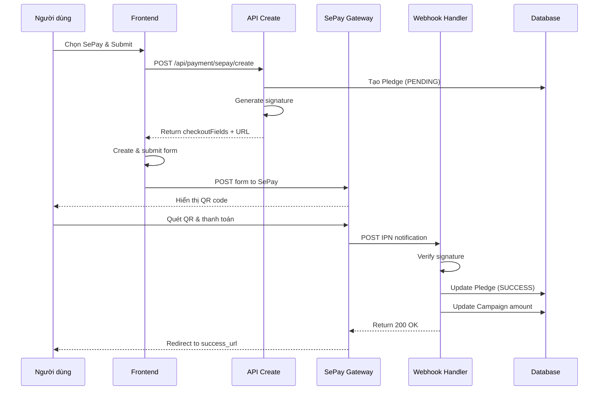

# Tích hợp SePay Payment Gateway

## Tổng quan

SePay là cổng thanh toán hỗ trợ nhiều phương thức thanh toán bao gồm:
- Chuyển khoản ngân hàng qua QR code
- NAPAS QR
- Thẻ quốc tế

## Cấu hình

### 1. Biến môi trường

Thêm các biến sau vào file `.env`:

```env
# SePay Payment Gateway
SEPAY_MERCHANT_ID="SP-TEST-NQ27239A"           # Merchant ID từ SePay
SEPAY_SECRET_KEY="spsk_test_w25k96kmb1ZgHQGVBfYDqoWk4giLHaMB"  # Secret Key từ SePay
SEPAY_ENV="sandbox"                             # sandbox hoặc production
```

### 2. Lấy thông tin tích hợp

#### Sandbox (Test)
1. Đăng ký tài khoản tại: https://my.sepay.vn/register
2. Vào mục "Cổng thanh toán" → "Đăng ký"
3. Chọn "Quét mã QR chuyển khoản ngân hàng" → "Bắt đầu ngay"
4. Chọn "Sandbox" và làm theo hướng dẫn
5. Sao chép `MERCHANT ID` và `SECRET KEY`

#### Production (Live)
1. Hoàn thành tích hợp và test ở Sandbox
2. Liên kết tài khoản ngân hàng thật
3. Chuyển sang Production từ dashboard
4. Cập nhật `MERCHANT ID` và `SECRET KEY` mới
5. Đổi `SEPAY_ENV` thành `production`

### 3. Cấu hình IPN (Webhook)

Cấu hình IPN URL trong SePay dashboard:

```
Production: https://yourdomain.com/api/payment/sepay/webhook
Development: https://your-ngrok-url.ngrok.io/api/payment/sepay/webhook
```

**Lưu ý:** Để test webhook ở local, sử dụng ngrok hoặc localtunnel:
```bash
npx ngrok http 3000
```

## Cấu trúc code

### 1. Helper Library (`src/lib/payment/sepay.ts`)

Thư viện helper xử lý:
- Tạo chữ ký HMAC SHA256
- Verify signature từ IPN
- Tạo checkout form fields
- Generate HTML form (optional)

### 2. API Routes

#### Create Payment (`src/app/api/payment/sepay/create/route.ts`)

Tạo giao dịch thanh toán mới:

```typescript
POST /api/payment/sepay/create

Body:
{
  "amount": 100000,
  "campaignId": "campaign-id",
  "tipAmount": 10000,
  "vatAmount": 0,
  "guestEmail": "user@example.com",
  "displayName": "Nguyen Van A",
  "isAnonymous": false,
  "ipAddress": "1.2.3.4"
}

Response:
{
  "checkoutUrl": "https://pay-sandbox.sepay.vn/v1/checkout/init",
  "checkoutFields": {
    "merchant": "SP-TEST-...",
    "currency": "VND",
    "order_amount": "110000",
    "operation": "PURCHASE",
    "order_description": "...",
    "order_invoice_number": "INV-...",
    "success_url": "...",
    "error_url": "...",
    "cancel_url": "...",
    "signature": "..."
  },
  "pledgeId": "pledge-id",
  "transactionId": "SEPAY-..."
}
```

#### Webhook/IPN (`src/app/api/payment/sepay/webhook/route.ts`)

Nhận thông báo từ SePay khi thanh toán thành công/thất bại:

```typescript
POST /api/payment/sepay/webhook

Headers:
{
  "Content-Type": "application/json",
  "x-sepay-signature": "optional_signature"
}

Body (từ SePay):
{
  "timestamp": 1759134682,
  "notification_type": "ORDER_PAID",
  "order": {
    "id": "e2c195be-c721-47eb-b323-99ab24e52d85",
    "order_status": "CAPTURED",
    "order_amount": "100000.00",
    "order_invoice_number": "INV-1759134677",
    ...
  },
  "transaction": {
    "id": "384c66dd-41e6-4316-a544-b4141682595c",
    "transaction_status": "APPROVED",
    "transaction_id": "68da43da2d9de",
    ...
  }
}
```

### 3. Frontend Integration

#### CheckoutButton Component

Component đã được cập nhật để hỗ trợ SePay:

```tsx
// src/app/campaigns/[slug]/CheckoutButton.tsx

const handleCreatePayment = async (method: string) => {
  const res = await fetch(`/api/payment/${method.toLowerCase()}/create`, {
    method: "POST",
    body: JSON.stringify({ amount, campaignId, ... })
  });
  
  const data = await res.json();
  
  // SePay trả về checkoutFields, cần submit form
  if (data.checkoutFields && data.checkoutUrl) {
    const form = document.createElement("form");
    form.method = "POST";
    form.action = data.checkoutUrl;
    
    Object.entries(data.checkoutFields).forEach(([key, value]) => {
      const input = document.createElement("input");
      input.type = "hidden";
      input.name = key;
      input.value = String(value);
      form.appendChild(input);
    });
    
    document.body.appendChild(form);
    form.submit();
  }
};
```

## Luồng thanh toán



## Testing

### 1. Test tạo thanh toán

```bash
curl -X POST http://localhost:3000/api/payment/sepay/create \
  -H "Content-Type: application/json" \
  -d '{
    "amount": 100000,
    "campaignId": "your-campaign-id",
    "tipAmount": 10000
  }'
```

### 2. Test webhook (local)

Sử dụng ngrok để expose local server:

```bash
# Terminal 1: Start dev server
npm run dev

# Terminal 2: Start ngrok
npx ngrok http 3000

# Cập nhật IPN URL trong SePay dashboard với ngrok URL
# VD: https://abc123.ngrok.io/api/payment/sepay/webhook
```

### 3. Test webhook manually

```bash
curl -X POST http://localhost:3000/api/payment/sepay/webhook \
  -H "Content-Type: application/json" \
  -d '{
    "timestamp": 1759134682,
    "notification_type": "ORDER_PAID",
    "order": {
      "id": "test-order-id",
      "order_status": "CAPTURED",
      "order_amount": "100000.00",
      "order_invoice_number": "INV-pledgeid-123456"
    },
    "transaction": {
      "id": "test-transaction-id",
      "transaction_status": "APPROVED",
      "transaction_id": "test-txn-123"
    }
  }'
```

## Xử lý lỗi

### 1. Signature không hợp lệ

```
[SEPAY WEBHOOK] Invalid signature
```

**Giải pháp:**
- Kiểm tra `SEPAY_SECRET_KEY` trong `.env`
- Đảm bảo secret key khớp với dashboard
- Kiểm tra format của signature

### 2. Pledge không tìm thấy

```
[SEPAY WEBHOOK] Pledge not found for invoice: INV-...
```

**Giải pháp:**
- Kiểm tra format của `order_invoice_number`
- Đảm bảo pledge đã được tạo trước khi webhook được gọi
- Kiểm tra database có pledge với ID tương ứng

### 3. Amount mismatch

```
[SEPAY WEBHOOK] Amount mismatch: expected 100000, received 90000
```

**Giải pháp:**
- Kiểm tra logic tính toán `totalAmount`
- Đảm bảo `tipAmount` và `vatAmount` được tính đúng
- Kiểm tra currency (VND)

## Go Live Checklist

- [ ] Test đầy đủ ở Sandbox
- [ ] Liên kết tài khoản ngân hàng thật
- [ ] Cập nhật `SEPAY_MERCHANT_ID` production
- [ ] Cập nhật `SEPAY_SECRET_KEY` production
- [ ] Đổi `SEPAY_ENV` thành `production`
- [ ] Cập nhật IPN URL thành production URL
- [ ] Cập nhật callback URLs (success_url, error_url, cancel_url)
- [ ] Test webhook với production credentials
- [ ] Monitor logs trong 24h đầu

## Tài liệu tham khảo

- [SePay Documentation](https://docs.sepay.vn)
- [SePay Dashboard](https://my.sepay.vn)
- [SePay Support](https://sepay.vn/support)

## Troubleshooting

### Webhook không được gọi

1. Kiểm tra IPN URL đã cấu hình đúng chưa
2. Kiểm tra server có thể truy cập từ internet không (dùng ngrok cho local)
3. Kiểm tra logs trong SePay dashboard
4. Đảm bảo endpoint trả về status 200

### Thanh toán thành công nhưng pledge vẫn PENDING

1. Kiểm tra webhook có được gọi không (check logs)
2. Kiểm tra signature verification
3. Kiểm tra logic xử lý trong webhook handler
4. Kiểm tra database transaction

### Form không submit được

1. Kiểm tra `checkoutFields` có đầy đủ không
2. Kiểm tra `signature` có được generate đúng không
3. Kiểm tra console browser có lỗi không
4. Thử submit form manually để debug
